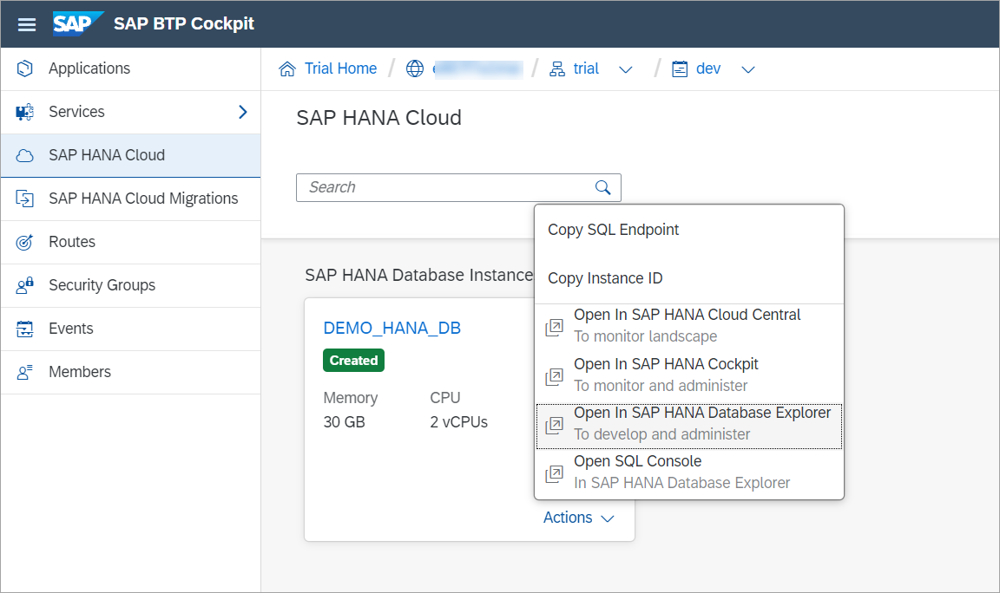
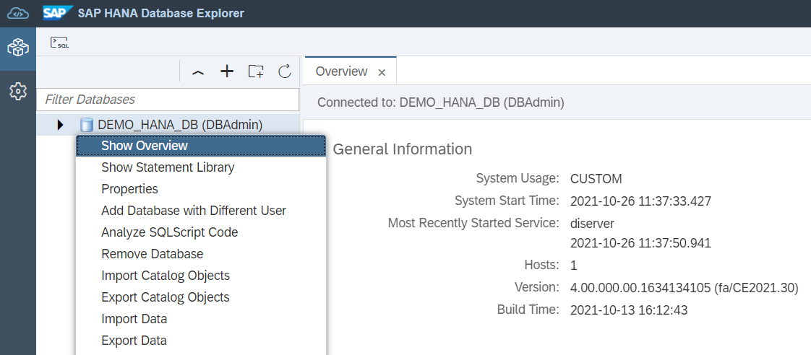
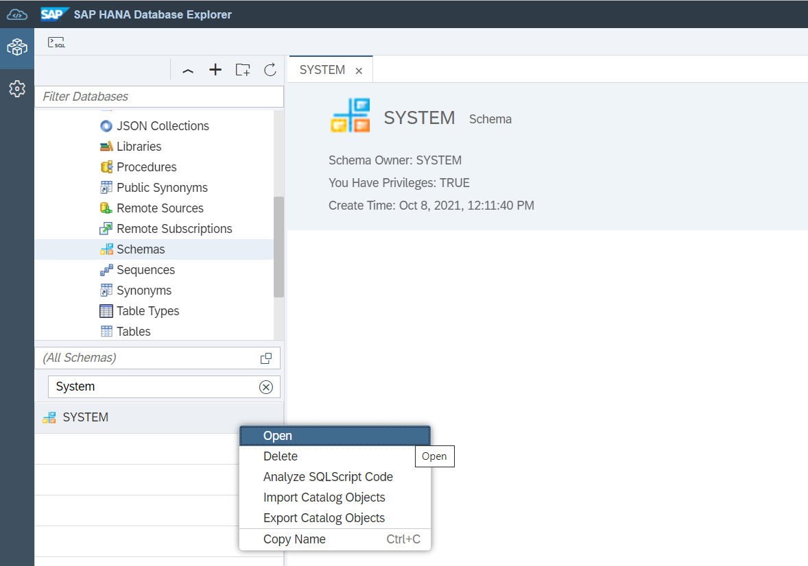

# Exercise 1 - Launch Database Explorer

In this excercise, we will launch an instance of SAP HANA Database Explorer and walk through some of its core features.

1. From the SAP BTP Cockpit, you can choose to open the SAP HANA Database Explorer by clicking the Actions dropdown on your instance, and selecting **Open in Database Explorer**.

      

    Note: Trial instances are shut down overnight. Instances can be restarted by clicking the **Manage SAP HANA Cloud** button, and selecting **Start** on the dropdown menu for your instance.

    You may be prompted to enter database login credentials at this point. Enter the DBADMIN user credentials which were set during the SAP HANA instance creation process.

2. Hover over your database in the databases menu. A summary should appear that identifies the type as a cockpit database.

    
    
     Right-click on the database name and select **Show Overview**. The release your database belongs to can be identified by looking at the last section of the Version field.

    

    *In this example, the database is from a release in July 2021, week 30 of the year.*

3. At the top of the left pane, click the arrow next to the database icon, to expand the object hierarchy for the database. You will see that it holds catalog objects and database diagnostic files (trace files, or log files).

    Expand **Catalog** then **Schemas**, this will present a list of the schemas available for this database. Directly above the list is a search bar, you can search for the **System** schema, and right-click and select **Open** to view details.

    

    
Continue to - [Exercise 2 - Using SQL Console](../ex2/README.md)

