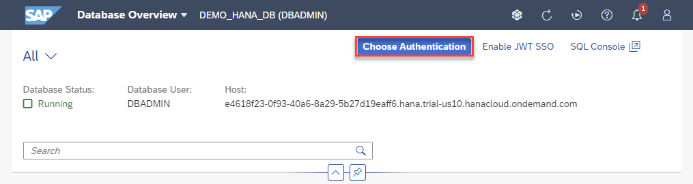
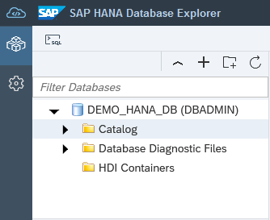
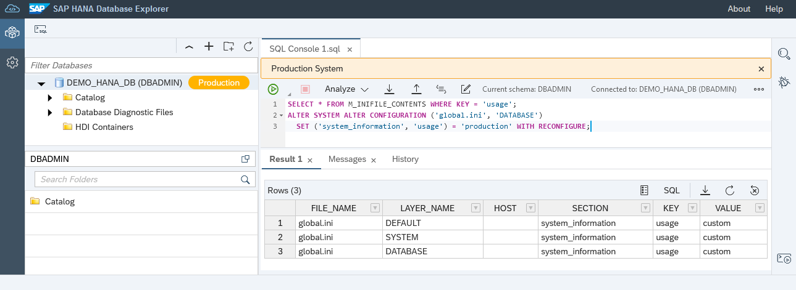
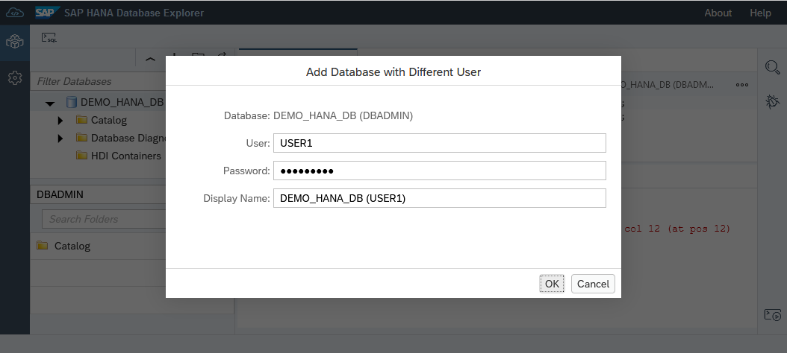
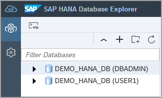
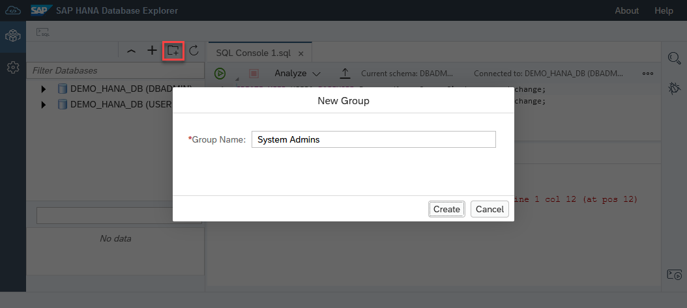
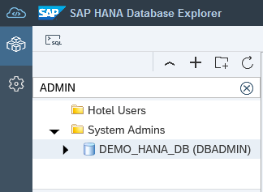

# Exercise 1 - Launch and Connect with the SAP HANA Database Explorer

In this exercise, we will launch an instance of the SAP HANA database explorer and walk through some of the features relating to databases.

1. From the SAP BTP Cockpit, you can choose to open the SAP HANA database explorer by clicking the **Actions** dropdown on your instance and selecting **Open in SAP HANA Database Explorer**.

    

    You may be prompted to enter database login credentials at this point. Enter the DBADMIN user credentials which were set during the SAP HANA instance creation process.

    >Note: Trial instances are shut down overnight. Instances can be restarted by clicking the **Manage SAP HANA Cloud** button and selecting **Start** on the dropdown menu for your instance.

    >Note: Credentials for a cockpit database can be saved within the SAP HANA cockpit, removing the need for users to log in each time they wish to access their database. For credentials to be saved, users must navigate to SAP HANA cockpit to save or manage their credentials.
    >
    >

2. Hover over your database in the database context menu. A summary should appear that identifies the type as a cockpit database.

    

     Right-click on the database name and select **Show Overview**. The release your database belongs to can be identified by looking at the last section of the Version field.

    

    *In this example, the database is from a release in July 2021, week 30 of the year.*

3. At the top of the left pane, click the arrow next to the database icon, to expand the object hierarchy for the database. You will see that it holds catalog objects and database diagnostic files (trace files, or log files).

    

    Expand **Catalog** then **Views**, this will present a list of the schemas available for this database. Directly above the list are search bars for schema and objects, you can search for the **SYS** schema and views that begin with **M_DATA**. Right-click and select **Open** to access those views. The search results for **M_DATA** contain a number of monitoring views for your database.

    


4. Users may benefit from visual clues identifying  production databases. To enable this, run the SQL statements below and refresh the browser.  
    >To open the SQL console, right-click on the database connection and select **Open SQL Console** or click on the toolbar icon in the top left.  
    
    >An instance of a SQL console is associated with the selected database.

    >To execute SQL commands, click on the green run arrow.

    ```SQL
    SELECT * FROM M_INIFILE_CONTENTS WHERE KEY = 'usage';
    ALTER SYSTEM ALTER CONFIGURATION ('global.ini', 'DATABASE') SET ('system_information', 'usage') = 'production' WITH RECONFIGURE;
    ```

    

    As this database is not a production database, we can turn off this setting by executing the below SQL statement.

    ```SQL
    ALTER SYSTEM ALTER CONFIGURATION ('global.ini', 'DATABASE') SET ('system_information', 'usage') = 'custom' WITH RECONFIGURE;
    ```

5. Let's create two new database users by running the following commands in the SQL console.

   ```SQL
   CREATE USER USER1 PASSWORD Password1 no force_first_password_change;
   CREATE USER USER2 PASSWORD Password2 no force_first_password_change;
   ```

   

6. We will create a new database connection with a different user. To do this, right-click over your existing database connection listed on the left panel. Select the **Add Database with Different User**. Use the credentials USER1 and Password1.

    

    

7. Organize your database connections by creating database groups. Use the folder icon at the top of your databases panel to create two groups named *System Admins* and *Hotel Users*. 

    

    Click and drag the DBAdmin connection into the System Admins group, and the USER1 connection to the Hotel Users group.

    

    A database can be quickly found using the filter as shown below.
    
    
    
This concludes the exercise on launching and exploring database connections in the SAP HANA database explorer.

Continue to - [Exercise 2 - Using the SQL Console](../ex2/README.md)
