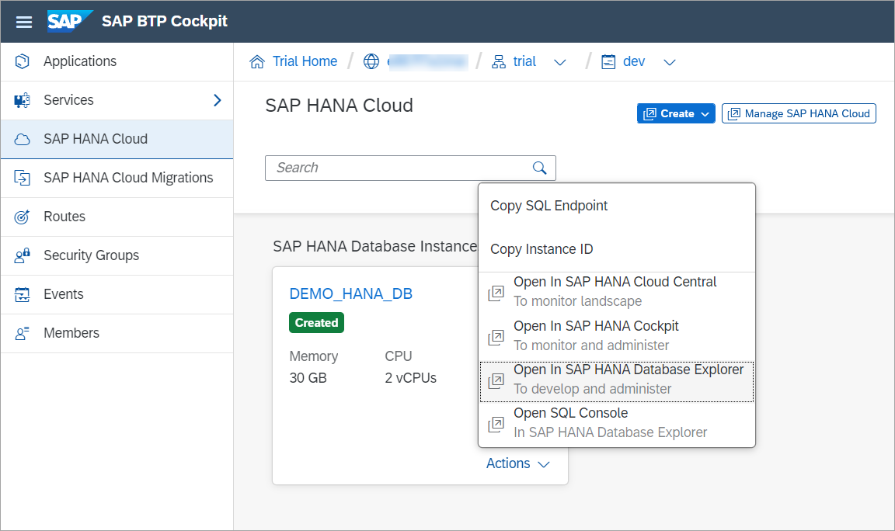
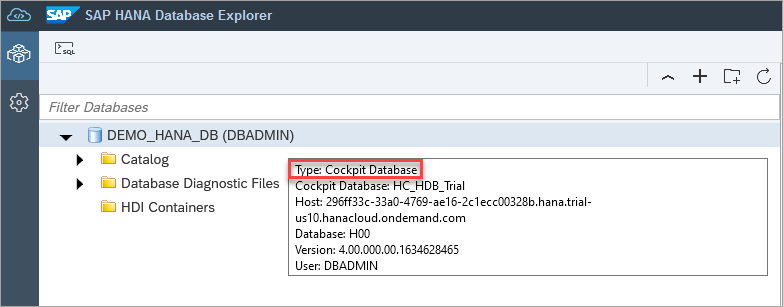
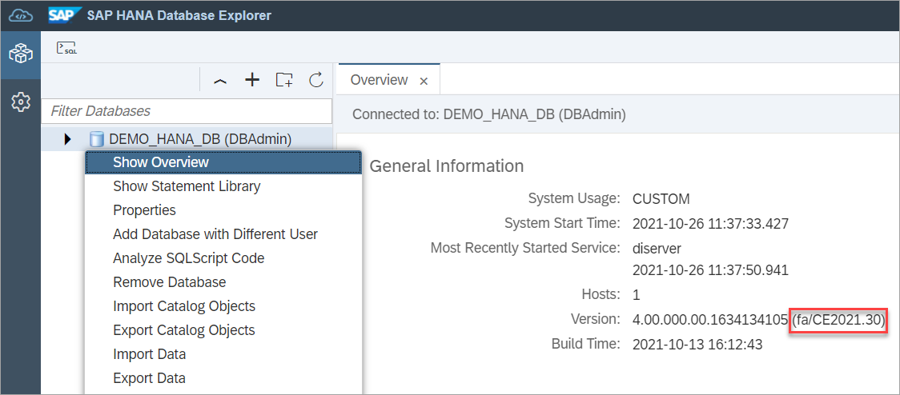
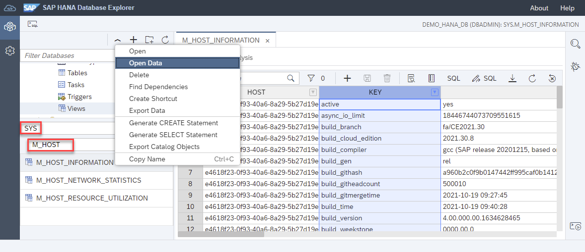

# Exercise 1 - Launch Database Explorer

In this exercise, we will launch an instance of SAP HANA Database Explorer and walk through some of its core features.

1. From the SAP BTP Cockpit, you can choose to open the SAP HANA Database Explorer by clicking the Actions dropdown on your instance, and selecting **Open in Database Explorer**.

    

    Note: Trial instances are shut down overnight. Instances can be restarted by clicking the **Manage SAP HANA Cloud** button, and selecting **Start** on the dropdown menu for your instance.

    You may be prompted to enter database login credentials at this point. Enter the DBADMIN user credentials which were set during the SAP HANA instance creation process.

    Credentials for a cockpit database can be saved within SAP HANA Cockpit, removing the need for users to log in each time they wish to access their database. For credentials to be saved, users must navigate to SAP HANA Cockpit to save or manage their credentials.

2. Hover over your database in the databases menu. A summary should appear that identifies the type as a cockpit database.

    

     Right-click on the database name and select **Show Overview**. The release your database belongs to can be identified by looking at the last section of the Version field.

    

    *In this example, the database is from a release in July 2021, week 30 of the year.*

3. At the top of the left pane, click the arrow next to the database icon, to expand the object hierarchy for the database. You will see that it holds catalog objects and database diagnostic files (trace files, or log files).

    Expand **Catalog** then **Views**, this will present a list of the schemas available for this database. Directly above the list are search bars for schema and objects, you can search for the **Sys** schema and views that begin with **m_data**. Once you right-click and select **Open** to access those views. The search results for **m_data** contain a number of monitoring views for your database.

    

4. Users may benefit from identifying the difference between production and non-production databases. To do this run the command below, replacing the **DATABASE** field with the name of your cockpit database.

    ```SQL
    SELECT * FROM M_INIFILE_CONTENTS WHERE KEY = 'usage';
    ALTER SYSTEM ALTER CONFIGURATION ('global.ini', 'DATABASE') SET ('system_information', 'usage') = 'production' WITH RECONFIGURE;
    ```
    
This concludes the exercise on launching database explorer.

Continue to - [Exercise 2 - Using SQL Console](../ex2/README.md)
