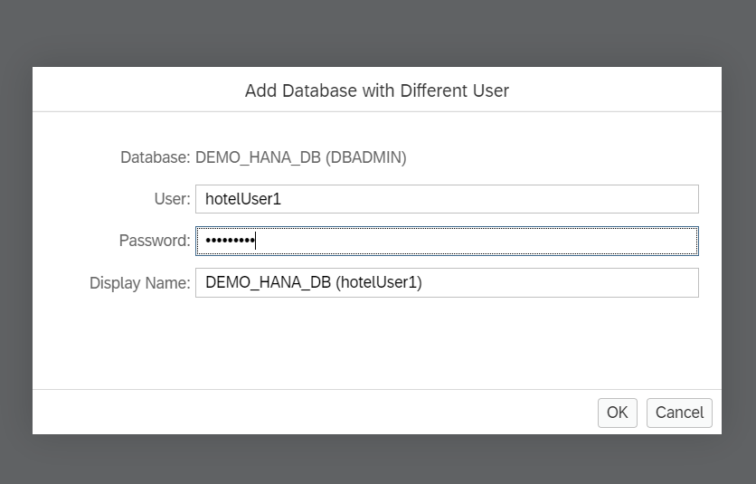
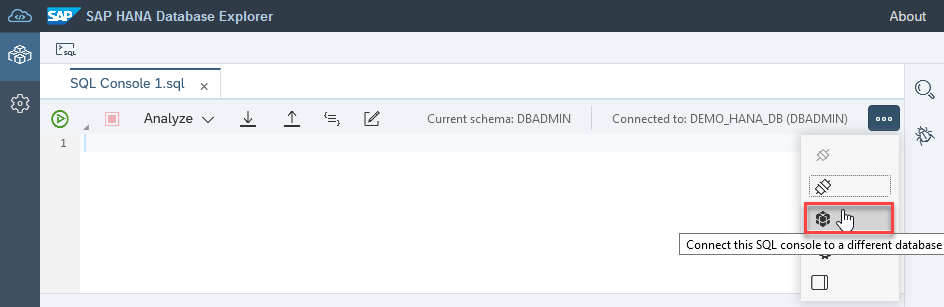
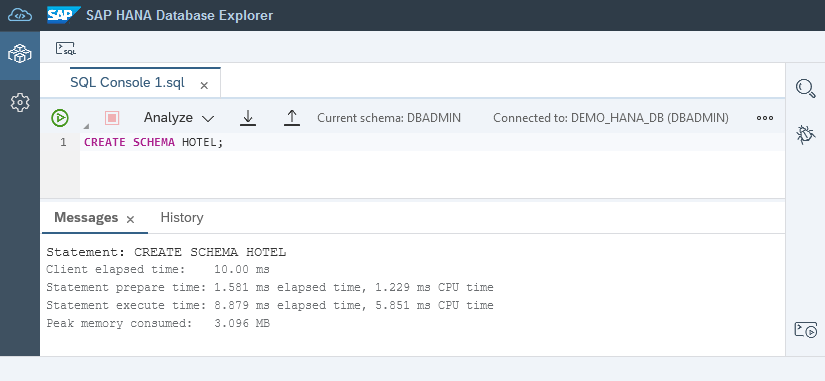
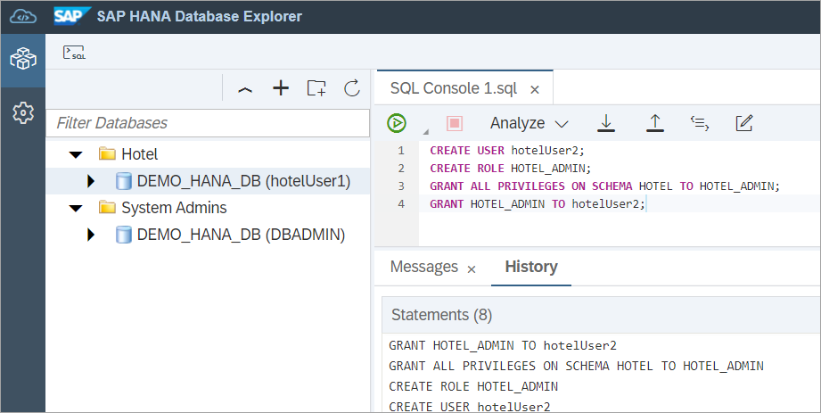
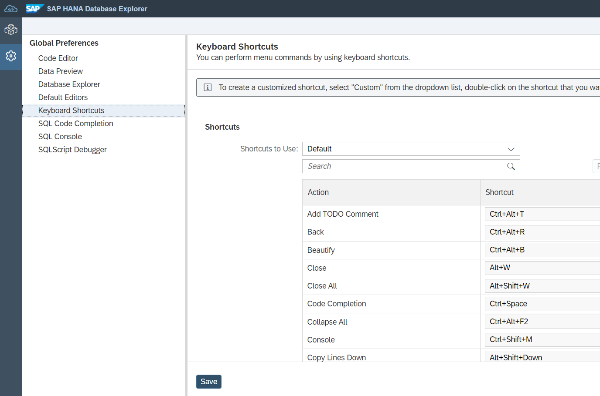
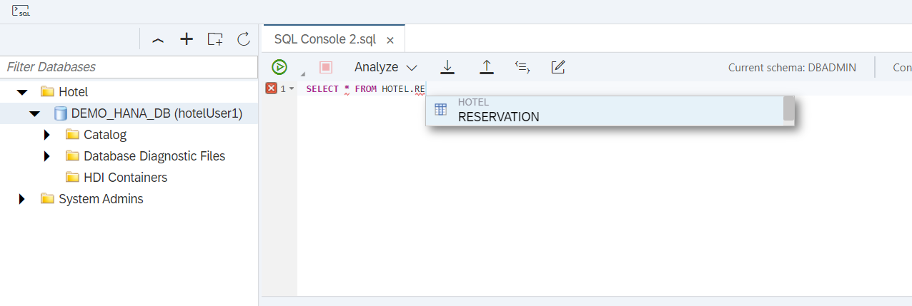
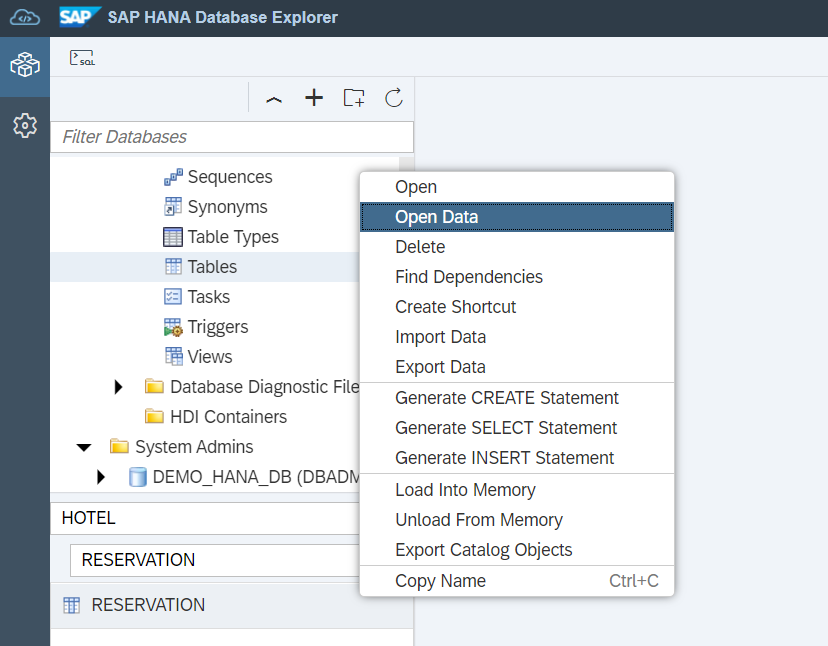
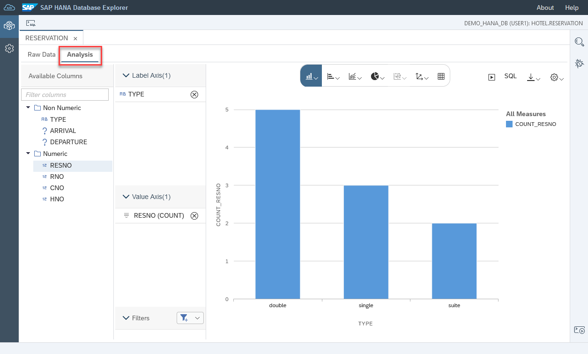
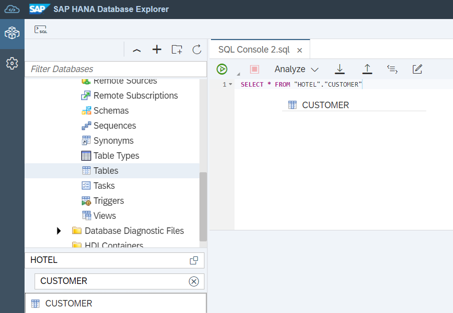

# Exercise 2 - Using SQL Console
In this exercise, we will use SAP HANA Database Explorer's SQL Console. Steps from this exercise are based on content from the SAP Tutorial Group [Getting Started with the SAP HANA Database Explorer](https://developers.sap.com/group.hana-cloud-get-started.html).

For the rest of this workshop, we will be creating and working with a sample schema titled **Hotel**. This will represent a basic hotel administration system.

1. First, lets add new users we will use in the proceeding steps by running the following commands in SQL Console. To open SQL Console, right-click on your desired database connection and select **Open SQL Console**. An instance of SQL Console is associated with the selected database connection only.

   ```SQL
   CREATE USER USER1 PASSWORD Password1 no force_first_password_change;
   CREATE USER USER2 PASSWORD Password2 no force_first_password_change;
   ```

2. We will create a new database connection with a different user. To do this, right-click over your existing database connection listed on the left panel. Select the "Add Database with Different User" option. Use the credentials User1 and Password1.

    Organize your database connections by creating database groups. Select the folder icon at the top of your databases panel, and name your new group *System Admins*, create a second new group named *Hotel*. Click and drag the DBAdmin connection into the System Admins group, and the User1 connection to the Hotel group.

      

3. Open a new SQL Console tab using the User1 connection you just created.

    

    We can open SQL console in full-screen by double tapping on the tab name. We can rename a tab by right-clicking and selecting **Rename**.

4. We will be creating a new schema by running the SQL command below. Type this into the SQL Console and click the green arrow at the top of your screen.

    ```SQL
    CREATE SCHEMA HOTEL;
    ```

   After running this command with the SQL console, you may notice that performance metrics are provided in the console output of database explorer under **Messages**.

   

    Create a role with privileges and assign to your user. Run the following commands in SQL console.

    ```SQL
    CREATE ROLE HOTEL_ADMIN;
    CREATE ROLE HOTEL_READER;

    GRANT ALL PRIVILEGES ON SCHEMA HOTEL TO HOTEL_ADMIN;
    GRANT SELECT ON SCHEMA HOTEL TO HOTEL_READER;

    GRANT HOTEL_ADMIN TO USER1;
    GRANT HOTEL_READER TO USER2;
    ```
    Beside the Messages tab, is another tab labelled **History**, click this tab to view previously run queries from SQL console.

    


5.  Populate your Hotel schema with some tables. Run the following code to create a series of tables for your Hotel schema.

    ```SQL
    CREATE COLUMN TABLE HOTEL.HOTEL(
        hno INTEGER PRIMARY KEY,
        name VARCHAR(50) NOT NULL,
        address VARCHAR(40) NOT NULL,
        city VARCHAR(30) NOT NULL,
        state VARCHAR(2) NOT NULL,
        zip VARCHAR(6),
        location ST_Point(4326)
    );
    CREATE COLUMN TABLE HOTEL.ROOM(
        hno INTEGER,
        type VARCHAR(6),
        free NUMERIC(3),
        price NUMERIC(6, 2),
        PRIMARY KEY (hno, type),
        FOREIGN KEY (hno) REFERENCES HOTEL.HOTEL
    );
    CREATE COLUMN TABLE HOTEL.CUSTOMER(
        cno INTEGER PRIMARY KEY,
        title VARCHAR(7),
        firstname VARCHAR(20),
        name VARCHAR(40) NOT NULL,
        address VARCHAR(40) NOT NULL,
        zip VARCHAR(6)
    );
    CREATE COLUMN TABLE HOTEL.RESERVATION(
        resno INTEGER NOT NULL GENERATED BY DEFAULT AS IDENTITY,
        rno INTEGER NOT NULL,
        cno INTEGER,
        hno INTEGER,
        type VARCHAR(6),
        arrival DATE NOT NULL,
        departure DATE NOT NULL,
        PRIMARY KEY (
            "RESNO", "ARRIVAL"
     ),
        FOREIGN KEY(hno) REFERENCES HOTEL.HOTEL,
        FOREIGN KEY(cno) REFERENCES HOTEL.CUSTOMER
    );
    CREATE COLUMN TABLE HOTEL.MAINTENANCE(
        mno INTEGER PRIMARY KEY,
        hno INTEGER,
        description VARCHAR(100),
        date_performed DATE,
        performed_by VARCHAR(40)
    );
    ```

6.  Add data into your tables by running the following SQL statements. If we anticipate this block of commands taking some time, we can choose to run it as a background activity while completing other tasks. To do this, click the small arrow beside the green arrow that runs commands. From the dropdown that appears, select **Run as a Background Activity**.

    ```SQL
    INSERT INTO HOTEL.HOTEL VALUES(10, 'Congress', '155 Beechwood St.', 'Seattle', 'WA', '98121', NEW ST_POINT('POINT(-122.347340 47.610546)', 4326));
    INSERT INTO HOTEL.HOTEL VALUES(11, 'Regency', '477 17th Avenue', 'Seattle', 'WA', '98177', NEW ST_POINT('POINT(-122.371104 47.715210)', 4326));
    INSERT INTO HOTEL.HOTEL VALUES(12, 'Long Island', '1499 Grove Street', 'Long Island', 'NY', '11716', NEW ST_POINT('POINT(-73.133741 40.783602)', 4326));
    INSERT INTO HOTEL.HOTEL VALUES(13, 'Empire State', '65 Yellowstone Dr.', 'Albany', 'NY', '12203', NEW ST_POINT('POINT(-73.816182 42.670334)', 4326));
    INSERT INTO HOTEL.HOTEL VALUES(14, 'Midtown', '12 Barnard St.', 'New York', 'NY', '10019', NEW ST_POINT('POINT(-73.987388 40.766153)', 4326));
    INSERT INTO HOTEL.HOTEL VALUES(15, 'Eighth Avenue', '112 8th Avenue', 'New York', 'NY', '10019', NEW ST_POINT('POINT(-73.982495 40.767161)', 4326));
    INSERT INTO HOTEL.HOTEL VALUES(16, 'Lake Michigan', '354 OAK Terrace', 'Chicago', 'IL', '60601', NEW ST_POINT('POINT(-87.623608 41.886403)', 4326));
    INSERT INTO HOTEL.HOTEL VALUES(17, 'Airport', '650 C Parkway', 'Rosemont', 'IL', '60018', NEW ST_POINT('POINT(-87.872209 41.989378)', 4326));
    INSERT INTO HOTEL.HOTEL VALUES(18, 'Sunshine', '200 Yellowstone Dr.', 'Clearwater', 'FL', '33755', NEW ST_POINT('POINT(-82.791689 27.971218)', 4326));
    INSERT INTO HOTEL.HOTEL VALUES(19, 'Beach', '1980 34th St.', 'Daytona Beach', 'FL', '32018', NEW ST_POINT('POINT(-81.043091 29.215968)', 4326));
    INSERT INTO HOTEL.HOTEL VALUES(20, 'Atlantic', '111 78th St.', 'Deerfield Beach', 'FL', '33441', NEW ST_POINT('POINT(-80.106612 26.312141)', 4326));
    INSERT INTO HOTEL.HOTEL VALUES(21, 'Long Beach', '35 Broadway', 'Long Beach', 'CA', '90804', NEW ST_POINT('POINT(-118.158403 33.786721)', 4326));
    INSERT INTO HOTEL.HOTEL VALUES(22, 'Indian Horse', '16 MAIN STREET', 'Palm Springs', 'CA', '92262', NEW ST_POINT('POINT(-116.543342 33.877537)', 4326));
    INSERT INTO HOTEL.HOTEL VALUES(23, 'Star', '13 Beechwood Place', 'Hollywood', 'CA', '90029', NEW ST_POINT('POINT(-118.295017 34.086975)', 4326));
    INSERT INTO HOTEL.HOTEL VALUES(24, 'River Boat', '788 MAIN STREET', 'New Orleans', 'LA', '70112', NEW ST_POINT('POINT(-90.076919 29.957531)', 4326));
    INSERT INTO HOTEL.HOTEL VALUES(25, 'Ocean Star', '45 Pacific Avenue', 'Atlantic City', 'NJ', '08401', NEW ST_POINT('POINT(-74.416135 39.361078)', 4326));
    INSERT INTO HOTEL.HOTEL VALUES(26, 'Bella Ciente', '1407 Marshall Ave', 'Longview', 'TX', '75601', NEW ST_POINT('POINT(-94.724051 32.514183)', 4326));

    INSERT INTO HOTEL.ROOM VALUES(10, 'single', 20, 135.00);
    INSERT INTO HOTEL.ROOM VALUES(10, 'double', 45, 200.00);
    INSERT INTO HOTEL.ROOM VALUES(12, 'single', 10, 70.00);
    INSERT INTO HOTEL.ROOM VALUES(12, 'double', 13, 100.00);
    INSERT INTO HOTEL.ROOM VALUES(13, 'single', 12, 45.00);
    INSERT INTO HOTEL.ROOM VALUES(13, 'double', 15, 80.00);
    INSERT INTO HOTEL.ROOM VALUES(14, 'single', 20, 85.00);
    INSERT INTO HOTEL.ROOM VALUES(14, 'double', 35, 140.00);
    INSERT INTO HOTEL.ROOM VALUES(15, 'single', 50, 105.00);
    INSERT INTO HOTEL.ROOM VALUES(15, 'double', 230, 180.00);
    INSERT INTO HOTEL.ROOM VALUES(15, 'suite', 12, 500.00);
    INSERT INTO HOTEL.ROOM VALUES(16, 'single', 10, 120.00);
    INSERT INTO HOTEL.ROOM VALUES(16, 'double', 39, 200.00);
    INSERT INTO HOTEL.ROOM VALUES(16, 'suite', 20, 500.00);
    INSERT INTO HOTEL.ROOM VALUES(17, 'single', 4, 115.00);
    INSERT INTO HOTEL.ROOM VALUES(17, 'double', 11, 180.00);
    INSERT INTO HOTEL.ROOM VALUES(18, 'single', 15, 90.00);
    INSERT INTO HOTEL.ROOM VALUES(18, 'double', 19, 150.00);
    INSERT INTO HOTEL.ROOM VALUES(18, 'suite', 5, 400.00);
    INSERT INTO HOTEL.ROOM VALUES(19, 'single', 45, 90.00);
    INSERT INTO HOTEL.ROOM VALUES(19, 'double', 145, 150.00);
    INSERT INTO HOTEL.ROOM VALUES(19, 'suite', 60, 300.00);
    INSERT INTO HOTEL.ROOM VALUES(20, 'single', 11, 60.00);
    INSERT INTO HOTEL.ROOM VALUES(20, 'double', 24, 100.00);
    INSERT INTO HOTEL.ROOM VALUES(21, 'single', 2, 70.00);
    INSERT INTO HOTEL.ROOM VALUES(21, 'double', 10, 130.00);
    INSERT INTO HOTEL.ROOM VALUES(22, 'single', 34, 80.00);
    INSERT INTO HOTEL.ROOM VALUES(22, 'double', 78, 140.00);
    INSERT INTO HOTEL.ROOM VALUES(22, 'suite', 55, 350.00);
    INSERT INTO HOTEL.ROOM VALUES(23, 'single', 89, 160.00);
    INSERT INTO HOTEL.ROOM VALUES(23, 'double', 300, 270.00);
    INSERT INTO HOTEL.ROOM VALUES(23, 'suite', 100, 700.00);
    INSERT INTO HOTEL.ROOM VALUES(24, 'single', 10, 125.00);
    INSERT INTO HOTEL.ROOM VALUES(24, 'double', 9, 200.00);
    INSERT INTO HOTEL.ROOM VALUES(24, 'suite', 78, 600.00);
    INSERT INTO HOTEL.ROOM VALUES(25, 'single', 44, 100.00);
    INSERT INTO HOTEL.ROOM VALUES(25, 'double', 115, 190.00);
    INSERT INTO HOTEL.ROOM VALUES(25, 'suite', 6, 450.00);

    INSERT INTO HOTEL.CUSTOMER VALUES(1000, 'Mrs', 'Jenny', 'Porter', '1340 N. Ash Street, #3', '10580');
    INSERT INTO HOTEL.CUSTOMER VALUES(1001, 'Mr', 'Peter', 'Brown', '1001 34th St., APT.3', '48226');
    INSERT INTO HOTEL.CUSTOMER VALUES(1002, 'Company', NULL, 'Datasoft', '486 Maple St.', '90018');
    INSERT INTO HOTEL.CUSTOMER VALUES(1003, 'Mrs', 'Rose', 'Brian', '500 Yellowstone Drive, #2', '75243');
    INSERT INTO HOTEL.CUSTOMER VALUES(1004, 'Mrs', 'Mary', 'Griffith', '3401 Elder Lane', '20005');
    INSERT INTO HOTEL.CUSTOMER VALUES(1005, 'Mr', 'Martin', 'Randolph', '340 MAIN STREET, #7', '60615');
    INSERT INTO HOTEL.CUSTOMER VALUES(1006, 'Mrs', 'Sally', 'Smith', '250 Curtis Street', '75243');
    INSERT INTO HOTEL.CUSTOMER VALUES(1007, 'Mr', 'Mike', 'Jackson', '133 BROADWAY APT. 1', '45211');
    INSERT INTO HOTEL.CUSTOMER VALUES(1008, 'Mrs', 'Rita', 'Doe', '2000 Humboldt St., #6', '97213');
    INSERT INTO HOTEL.CUSTOMER VALUES(1009, 'Mr', 'George', 'Howe', '111 B Parkway, #23', '75243');
    INSERT INTO HOTEL.CUSTOMER VALUES(1010, 'Mr', 'Frank', 'Miller', '27 5th St., 76', '95054');
    INSERT INTO HOTEL.CUSTOMER VALUES(1011, 'Mrs', 'Susan', 'Baker', '200 MAIN STREET, #94', '90018');
    INSERT INTO HOTEL.CUSTOMER VALUES(1012, 'Mr', 'Joseph', 'Peters', '700 S. Ash St., APT.12', '92714');
    INSERT INTO HOTEL.CUSTOMER VALUES(1013, 'Company', NULL, 'TOOLware', '410 Mariposa St., #10', '20019');
    INSERT INTO HOTEL.CUSTOMER VALUES(1014, 'Mr', 'Antony', 'Jenkins', '55 A Parkway, #15', '20903');

    INSERT INTO HOTEL.RESERVATION VALUES(1, 100, 1000, 11, 'single', '2020-12-24', '2020-12-27');
    INSERT INTO HOTEL.RESERVATION VALUES(2, 110, 1001, 11, 'double', '2020-12-24', '2021-01-03');
    INSERT INTO HOTEL.RESERVATION VALUES(3, 120, 1002, 15, 'suite', '2020-11-14', '2020-11-18');
    INSERT INTO HOTEL.RESERVATION VALUES(4, 130, 1009, 21, 'single', '2019-02-01', '2019-02-03');
    INSERT INTO HOTEL.RESERVATION VALUES(5, 150, 1006, 17, 'double', '2019-03-14', '2019-03-24');
    INSERT INTO HOTEL.RESERVATION VALUES(6, 140, 1013, 20, 'double', '2020-04-12', '2020-04-30');
    INSERT INTO HOTEL.RESERVATION VALUES(7, 160, 1011, 17, 'single', '2020-04-12', '2020-04-15');
    INSERT INTO HOTEL.RESERVATION VALUES(8, 170, 1014, 25, 'suite', '2020-09-01', '2020-09-03');
    INSERT INTO HOTEL.RESERVATION VALUES(9, 180, 1001, 22, 'double', '2020-12-23', '2021-01-08');
    INSERT INTO HOTEL.RESERVATION VALUES(10, 190, 1013, 24, 'double', '2020-11-14', '2020-11-17');

    INSERT INTO HOTEL.MAINTENANCE VALUES(10, 24, 'Replace pool liner and pump', '2019-03-21', 'Discount Pool Supplies');
    INSERT INTO HOTEL.MAINTENANCE VALUES(11, 25, 'Renovate the bar area.  Replace TV and speakers', '2020-11-29', 'TV and Audio Superstore');
    INSERT INTO HOTEL.MAINTENANCE VALUES(12, 26, 'Roof repair due to storm', null, null);
    ```

    

    Similar to running a script as a background activity, the **Run on Multiple Databases** is an option available to run a single command on multiple databases.

7.  A list of keyboard shortcuts can be found by right-clicking within a SQL console window.

    

    Navigate back to SQL console and copy the below command in all lowercase, then type Ctrl+ to select the current line. Type Ctrl+Alt+U to make the text uppercase, and F9 to run the current statement. This statement will create a partition that contains older reservations and one that contains reservations made in 2019 or later.

     ```SQL
    alter table hotel.reservation partition by range(arrival)
    ((
    partition '2000-01-01' <= values < '2019-01-01',
    partition others
    ));
    ```

    Here is a list of popular keyboard shortcuts for future reference:
    Action | Shortcut
    ------ | ------
    Comment/Uncomment Line | Ctrl+/
    Add Comment Block | Ctrl+Shift+/
    Format Code	|Ctrl+B
    Switch tabs	|Ctrl+Alt+Pageup  or Ctrl+Alt+Pagedown
    Close Window  |	Ctrl+W
    Run All | F8
    Run Statement |	F9
    Increase/Decrease Font Size | Ctrl+Shift+Up  or Ctrl+Shift+Down
    Go to Next Error | Alt+E
    Go to Previous Error | Alt+Shift+E

8.  Code completion is a tool available within SQL console. To use this feature type ``SE`` and then use Ctrl+Space on your keyboard to view a list of options. You can also type  ``SELECT * FROM HOTEL.RE`` and use Ctrl+Space on your keyboard to view a list of recommended tables.

    

9.  To understand your data better, let's view an analysis of the Reservations table. Using the navigator on the left, select Catalog, then Tables, and search for the Reservations table.

   

   Once found, right-click on Reservations and select **Open Data**.

   At the top of your screen, select the **Analysis** tab. Drag and drop the Type attribute into the Label Axis section. Next drag and drop the RESNO field into the Value Axis section. Wait a few seconds and a chart should be formed. Alternate chart types can be selected at the top of the screen.

   

12. A user can drag and drop database objects from the menu on the left to complete SQL queries. From the database menu, select Catalog, then Tables. Search "Hotel" in the Schema field below. Type ``SELECT * FROM`` and click and drag the HOTEL.CUSTOMER table from the menu.

    

13. Find and Replace is available within SQL console. The keyboard shortcut for this tool is Ctrl+Alt+K. Highlight the text you wish to update and use the shortcut to update all instances of this text.

14. On the right-hand side of the SQL console, there is a Statement Help panel that provides more information about statement syntax, and any tables, functions, stored procedures, or SQL functions that have been referenced.

    Expand the Statement/Syntax or Tables and Views sections of the Statement Help panel, and copy the following SQL into the SQL console to populate the Statement/Syntax section of the help panel:

    ```SQL
    SELECT
    H.NAME AS HOTEL_NAME,
    R.TYPE,
    R.FREE,
    R.PRICE
    FROM
    HOTEL.ROOM AS R
    LEFT OUTER JOIN
    HOTEL.HOTEL AS H
    ON R.HNO = H.HNO;
    ```
    [](images/StatementHelp.png)


This concludes the exercise on the using SQL Console.

Continue to - [Exercise 3 - Catalog Browser and Object Search](../ex3/README.md)
