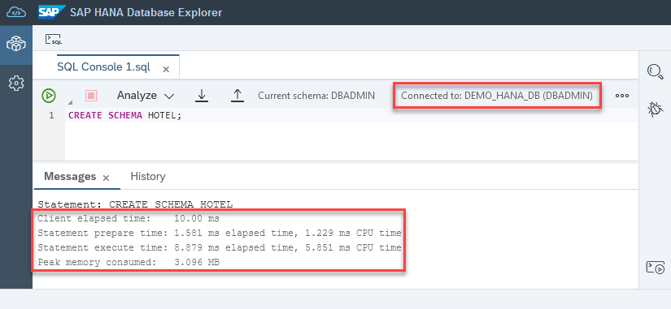
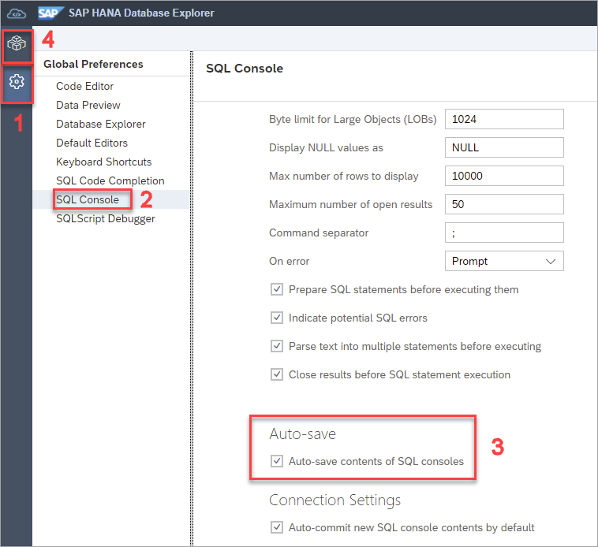
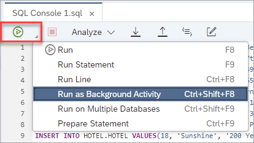
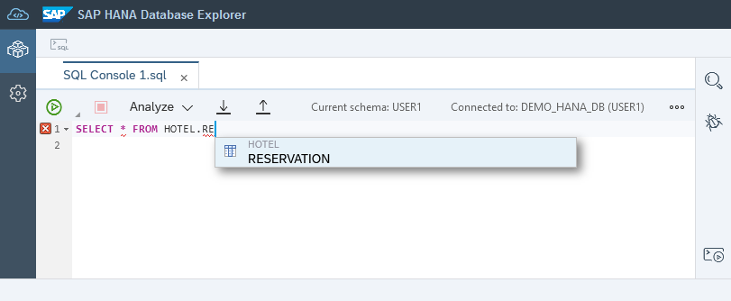
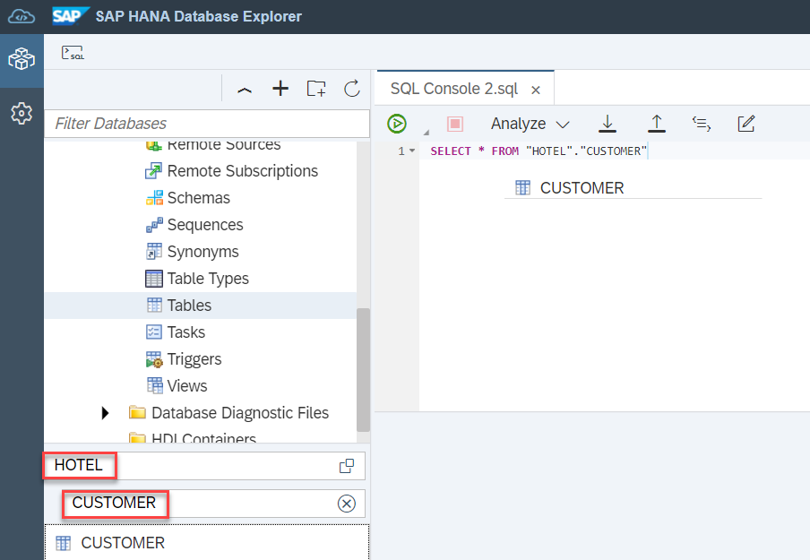
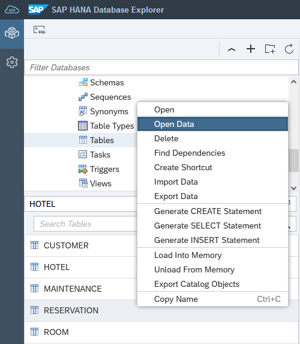

# Exercise 2 - Using the SQL Console
In this exercise, we will use SAP HANA database explorer's SQL console. Steps from this exercise are based on content from the SAP Tutorial Group [Getting Started with the SAP HANA Database Explorer](https://developers.sap.com/group.hana-cloud-get-started.html).

For the rest of this workshop, we will be creating and working with a sample schema named **HOTEL**. This will represent a basic hotel administration system.


1. Using the DBAdmin connection, create a new schema by running the SQL command below. 

    ```SQL
    CREATE SCHEMA HOTEL;
    ```

    >Note: The SQL console must be connected with the DBADMIN connection as USER1 has not yet been assigned privileges.

   After running this command with the SQL console, you may notice that resource consumption metrics are provided under **Messages**.

   

    Continuing the use of the DBAdmin connection, let's assign the users we created in the last exercise to roles with privileges on the HOTEL schema.

    ```SQL
    CREATE ROLE HOTEL_ADMIN;
    CREATE ROLE HOTEL_READER;

    GRANT ALL PRIVILEGES ON SCHEMA HOTEL TO HOTEL_ADMIN;
    GRANT SELECT ON SCHEMA HOTEL TO HOTEL_READER;

    GRANT HOTEL_ADMIN TO USER1;
    GRANT HOTEL_READER TO USER2;
    ```
    Beside the Messages tab, is another tab labelled **History**, click this tab to view previously run queries from SQL console.

    

    > Note:  Items from the history can be dragged into the SQL console.  

2. For the rest of the exercise, we will use SQL console associated with the USER1 connection.  Change the connection to use **DEMO_HANA_DB (USER1)** instead as shown below. Click the highlighted icon, and select the User1 connection.

    >Note: The SQL console can be opened in full-screen mode by double tapping on the tab name. There is also an option to rename tabs in the right-click context menu.

    

3. Let's verify the SQL Console settings for this connection. Navigate to the database explorer settings icon on the left of your screen, and select SQL Console. Confirm that AutoSave settings are checked off. Click **Save** and return to database explorer.
   
   

4. Populate the HOTEL schema with some tables. Run the following SQL statements.

    ```SQL
    CREATE COLUMN TABLE HOTEL.HOTEL(
        hno INTEGER PRIMARY KEY,
        name VARCHAR(50) NOT NULL,
        address VARCHAR(40) NOT NULL,
        city VARCHAR(30) NOT NULL,
        state VARCHAR(2) NOT NULL,
        zip VARCHAR(6),
        location ST_Point(4326)
    );
    CREATE COLUMN TABLE HOTEL.ROOM(
        hno INTEGER,
        type VARCHAR(6),
        free NUMERIC(3),
        price NUMERIC(6, 2),
        PRIMARY KEY (hno, type),
        FOREIGN KEY (hno) REFERENCES HOTEL.HOTEL
    );
    CREATE COLUMN TABLE HOTEL.CUSTOMER(
        cno INTEGER PRIMARY KEY,
        title VARCHAR(7),
        firstname VARCHAR(20),
        name VARCHAR(40) NOT NULL,
        address VARCHAR(40) NOT NULL,
        zip VARCHAR(6)
    );
    CREATE COLUMN TABLE HOTEL.RESERVATION(
        resno INTEGER NOT NULL GENERATED BY DEFAULT AS IDENTITY,
        rno INTEGER NOT NULL,
        cno INTEGER,
        hno INTEGER,
        type VARCHAR(6),
        arrival DATE NOT NULL,
        departure DATE NOT NULL,
        PRIMARY KEY (
            "RESNO", "ARRIVAL"
     ),
        FOREIGN KEY(hno) REFERENCES HOTEL.HOTEL,
        FOREIGN KEY(cno) REFERENCES HOTEL.CUSTOMER
    );
    CREATE COLUMN TABLE HOTEL.MAINTENANCE(
        mno INTEGER PRIMARY KEY,
        hno INTEGER,
        description VARCHAR(100),
        date_performed DATE,
        performed_by VARCHAR(40)
    );
    ```

5.  Add data into your tables by running the following SQL statements. If we anticipate a command to take some time, we can choose to run it as a background activity while completing other tasks.  To do this, click the small arrow beside the green arrow that runs commands. From the dropdown that appears, select **Run as a Background Activity**. You will be prompted to specify how your system should respond to errors as shown below.

    ```SQL
    INSERT INTO HOTEL.HOTEL VALUES(10, 'Congress', '155 Beechwood St.', 'Seattle', 'WA', '98121', NEW ST_POINT('POINT(-122.347340 47.610546)', 4326));
    INSERT INTO HOTEL.HOTEL VALUES(11, 'Regency', '477 17th Avenue', 'Seattle', 'WA', '98177', NEW ST_POINT('POINT(-122.371104 47.715210)', 4326));
    INSERT INTO HOTEL.HOTEL VALUES(12, 'Long Island', '1499 Grove Street', 'Long Island', 'NY', '11716', NEW ST_POINT('POINT(-73.133741 40.783602)', 4326));
    INSERT INTO HOTEL.HOTEL VALUES(13, 'Empire State', '65 Yellowstone Dr.', 'Albany', 'NY', '12203', NEW ST_POINT('POINT(-73.816182 42.670334)', 4326));
    INSERT INTO HOTEL.HOTEL VALUES(14, 'Midtown', '12 Barnard St.', 'New York', 'NY', '10019', NEW ST_POINT('POINT(-73.987388 40.766153)', 4326));
    INSERT INTO HOTEL.HOTEL VALUES(15, 'Eighth Avenue', '112 8th Avenue', 'New York', 'NY', '10019', NEW ST_POINT('POINT(-73.982495 40.767161)', 4326));
    INSERT INTO HOTEL.HOTEL VALUES(16, 'Lake Michigan', '354 OAK Terrace', 'Chicago', 'IL', '60601', NEW ST_POINT('POINT(-87.623608 41.886403)', 4326));
    INSERT INTO HOTEL.HOTEL VALUES(17, 'Airport', '650 C Parkway', 'Rosemont', 'IL', '60018', NEW ST_POINT('POINT(-87.872209 41.989378)', 4326));
    INSERT INTO HOTEL.HOTEL VALUES(18, 'Sunshine', '200 Yellowstone Dr.', 'Clearwater', 'FL', '33755', NEW ST_POINT('POINT(-82.791689 27.971218)', 4326));
    INSERT INTO HOTEL.HOTEL VALUES(19, 'Beach', '1980 34th St.', 'Daytona Beach', 'FL', '32018', NEW ST_POINT('POINT(-81.043091 29.215968)', 4326));
    INSERT INTO HOTEL.HOTEL VALUES(20, 'Atlantic', '111 78th St.', 'Deerfield Beach', 'FL', '33441', NEW ST_POINT('POINT(-80.106612 26.312141)', 4326));
    INSERT INTO HOTEL.HOTEL VALUES(21, 'Long Beach', '35 Broadway', 'Long Beach', 'CA', '90804', NEW ST_POINT('POINT(-118.158403 33.786721)', 4326));
    INSERT INTO HOTEL.HOTEL VALUES(22, 'Indian Horse', '16 MAIN STREET', 'Palm Springs', 'CA', '92262', NEW ST_POINT('POINT(-116.543342 33.877537)', 4326));
    INSERT INTO HOTEL.HOTEL VALUES(23, 'Star', '13 Beechwood Place', 'Hollywood', 'CA', '90029', NEW ST_POINT('POINT(-118.295017 34.086975)', 4326));
    INSERT INTO HOTEL.HOTEL VALUES(24, 'River Boat', '788 MAIN STREET', 'New Orleans', 'LA', '70112', NEW ST_POINT('POINT(-90.076919 29.957531)', 4326));
    INSERT INTO HOTEL.HOTEL VALUES(25, 'Ocean Star', '45 Pacific Avenue', 'Atlantic City', 'NJ', '08401', NEW ST_POINT('POINT(-74.416135 39.361078)', 4326));
    INSERT INTO HOTEL.HOTEL VALUES(26, 'Bella Ciente', '1407 Marshall Ave', 'Longview', 'TX', '75601', NEW ST_POINT('POINT(-94.724051 32.514183)', 4326));

    INSERT INTO HOTEL.ROOM VALUES(10, 'single', 20, 135.00);
    INSERT INTO HOTEL.ROOM VALUES(10, 'double', 45, 200.00);
    INSERT INTO HOTEL.ROOM VALUES(12, 'single', 10, 70.00);
    INSERT INTO HOTEL.ROOM VALUES(12, 'double', 13, 100.00);
    INSERT INTO HOTEL.ROOM VALUES(13, 'single', 12, 45.00);
    INSERT INTO HOTEL.ROOM VALUES(13, 'double', 15, 80.00);
    INSERT INTO HOTEL.ROOM VALUES(14, 'single', 20, 85.00);
    INSERT INTO HOTEL.ROOM VALUES(14, 'double', 35, 140.00);
    INSERT INTO HOTEL.ROOM VALUES(15, 'single', 50, 105.00);
    INSERT INTO HOTEL.ROOM VALUES(15, 'double', 230, 180.00);
    INSERT INTO HOTEL.ROOM VALUES(15, 'suite', 12, 500.00);
    INSERT INTO HOTEL.ROOM VALUES(16, 'single', 10, 120.00);
    INSERT INTO HOTEL.ROOM VALUES(16, 'double', 39, 200.00);
    INSERT INTO HOTEL.ROOM VALUES(16, 'suite', 20, 500.00);
    INSERT INTO HOTEL.ROOM VALUES(17, 'single', 4, 115.00);
    INSERT INTO HOTEL.ROOM VALUES(17, 'double', 11, 180.00);
    INSERT INTO HOTEL.ROOM VALUES(18, 'single', 15, 90.00);
    INSERT INTO HOTEL.ROOM VALUES(18, 'double', 19, 150.00);
    INSERT INTO HOTEL.ROOM VALUES(18, 'suite', 5, 400.00);
    INSERT INTO HOTEL.ROOM VALUES(19, 'single', 45, 90.00);
    INSERT INTO HOTEL.ROOM VALUES(19, 'double', 145, 150.00);
    INSERT INTO HOTEL.ROOM VALUES(19, 'suite', 60, 300.00);
    INSERT INTO HOTEL.ROOM VALUES(20, 'single', 11, 60.00);
    INSERT INTO HOTEL.ROOM VALUES(20, 'double', 24, 100.00);
    INSERT INTO HOTEL.ROOM VALUES(21, 'single', 2, 70.00);
    INSERT INTO HOTEL.ROOM VALUES(21, 'double', 10, 130.00);
    INSERT INTO HOTEL.ROOM VALUES(22, 'single', 34, 80.00);
    INSERT INTO HOTEL.ROOM VALUES(22, 'double', 78, 140.00);
    INSERT INTO HOTEL.ROOM VALUES(22, 'suite', 55, 350.00);
    INSERT INTO HOTEL.ROOM VALUES(23, 'single', 89, 160.00);
    INSERT INTO HOTEL.ROOM VALUES(23, 'double', 300, 270.00);
    INSERT INTO HOTEL.ROOM VALUES(23, 'suite', 100, 700.00);
    INSERT INTO HOTEL.ROOM VALUES(24, 'single', 10, 125.00);
    INSERT INTO HOTEL.ROOM VALUES(24, 'double', 9, 200.00);
    INSERT INTO HOTEL.ROOM VALUES(24, 'suite', 78, 600.00);
    INSERT INTO HOTEL.ROOM VALUES(25, 'single', 44, 100.00);
    INSERT INTO HOTEL.ROOM VALUES(25, 'double', 115, 190.00);
    INSERT INTO HOTEL.ROOM VALUES(25, 'suite', 6, 450.00);

    INSERT INTO HOTEL.CUSTOMER VALUES(1000, 'Mrs', 'Jenny', 'Porter', '1340 N. Ash Street, #3', '10580');
    INSERT INTO HOTEL.CUSTOMER VALUES(1001, 'Mr', 'Peter', 'Brown', '1001 34th St., APT.3', '48226');
    INSERT INTO HOTEL.CUSTOMER VALUES(1002, 'Company', NULL, 'Datasoft', '486 Maple St.', '90018');
    INSERT INTO HOTEL.CUSTOMER VALUES(1003, 'Mrs', 'Rose', 'Brian', '500 Yellowstone Drive, #2', '75243');
    INSERT INTO HOTEL.CUSTOMER VALUES(1004, 'Mrs', 'Mary', 'Griffith', '3401 Elder Lane', '20005');
    INSERT INTO HOTEL.CUSTOMER VALUES(1005, 'Mr', 'Martin', 'Randolph', '340 MAIN STREET, #7', '60615');
    INSERT INTO HOTEL.CUSTOMER VALUES(1006, 'Mrs', 'Sally', 'Smith', '250 Curtis Street', '75243');
    INSERT INTO HOTEL.CUSTOMER VALUES(1007, 'Mr', 'Mike', 'Jackson', '133 BROADWAY APT. 1', '45211');
    INSERT INTO HOTEL.CUSTOMER VALUES(1008, 'Mrs', 'Rita', 'Doe', '2000 Humboldt St., #6', '97213');
    INSERT INTO HOTEL.CUSTOMER VALUES(1009, 'Mr', 'George', 'Howe', '111 B Parkway, #23', '75243');
    INSERT INTO HOTEL.CUSTOMER VALUES(1010, 'Mr', 'Frank', 'Miller', '27 5th St., 76', '95054');
    INSERT INTO HOTEL.CUSTOMER VALUES(1011, 'Mrs', 'Susan', 'Baker', '200 MAIN STREET, #94', '90018');
    INSERT INTO HOTEL.CUSTOMER VALUES(1012, 'Mr', 'Joseph', 'Peters', '700 S. Ash St., APT.12', '92714');
    INSERT INTO HOTEL.CUSTOMER VALUES(1013, 'Company', NULL, 'TOOLware', '410 Mariposa St., #10', '20019');
    INSERT INTO HOTEL.CUSTOMER VALUES(1014, 'Mr', 'Antony', 'Jenkins', '55 A Parkway, #15', '20903');

    INSERT INTO HOTEL.RESERVATION VALUES(1, 100, 1000, 11, 'single', '2020-12-24', '2020-12-27');
    INSERT INTO HOTEL.RESERVATION VALUES(2, 110, 1001, 11, 'double', '2020-12-24', '2021-01-03');
    INSERT INTO HOTEL.RESERVATION VALUES(3, 120, 1002, 15, 'suite', '2020-11-14', '2020-11-18');
    INSERT INTO HOTEL.RESERVATION VALUES(4, 130, 1009, 21, 'single', '2019-02-01', '2019-02-03');
    INSERT INTO HOTEL.RESERVATION VALUES(5, 150, 1006, 17, 'double', '2019-03-14', '2019-03-24');
    INSERT INTO HOTEL.RESERVATION VALUES(6, 140, 1013, 20, 'double', '2020-04-12', '2020-04-30');
    INSERT INTO HOTEL.RESERVATION VALUES(7, 160, 1011, 17, 'single', '2020-04-12', '2020-04-15');
    INSERT INTO HOTEL.RESERVATION VALUES(8, 170, 1014, 25, 'suite', '2020-09-01', '2020-09-03');
    INSERT INTO HOTEL.RESERVATION VALUES(9, 180, 1001, 22, 'double', '2020-12-23', '2021-01-08');
    INSERT INTO HOTEL.RESERVATION VALUES(10, 190, 1013, 24, 'double', '2020-11-14', '2020-11-17');

    INSERT INTO HOTEL.MAINTENANCE VALUES(10, 24, 'Replace pool liner and pump', '2019-03-21', 'Discount Pool Supplies');
    INSERT INTO HOTEL.MAINTENANCE VALUES(11, 25, 'Renovate the bar area.  Replace TV and speakers', '2020-11-29', 'TV and Audio Superstore');
    INSERT INTO HOTEL.MAINTENANCE VALUES(12, 26, 'Roof repair due to storm', null, null);
    ```
    

    

    The Background Activities Monitor can be used to view the status. The Open Details icon will allow you to view the output of the commands. Once a command has been run as a Background Activity, SQL console will close the connection used to run the command. Reopen the connection before proceeding.

    

    >Similar to running a script as a background activity, the **Run on Multiple Databases** is an option available to run SQL statements on multiple databases.
    
    >

6. Find and Replace is available within a SQL console. The keyboard shortcut for this tool is **Ctrl+F**.  Once the Find tool appears on your screen, click the **+** sign to expand the Replace option.

    

7.  A list of keyboard shortcuts can be found by right-clicking and selecting **Keyboard Shortcuts** within the SQL console window.

    

    Navigate back to the SQL console and copy the below command.  Highlight the statement using the mouse.  Type **Ctrl+Alt+U** to make the text uppercase, and **F9** to run the current statement. This statement will create a partition that contains older reservations and one that contains reservations made in 2020 or later.

     ```SQL
    alter table hotel.reservation partition by range(arrival)
    ((
    partition '2000-01-01' <= values < '2020-01-01',
    partition others
    ));
    ```

    Here is a list of popular keyboard shortcuts for future reference:
    Action | Shortcut
    ------ | ------
    Add Comment Block | Ctrl+Shift+/
    Comment/Uncomment Line | Ctrl+/
    Format Code	|Ctrl+B
    Go to Next Error | Alt+E
    Go to Previous Error | Alt+Shift+E
    Increase/Decrease Font Size | Ctrl+Shift+Up  or Ctrl+Shift+Down
    Jump to Matching Brackets | Ctrl+Shift+M
    Run All | F8
    Run Statement |	F9
    Switch tabs	|Ctrl+Alt+Pageup  or Ctrl+Alt+Pagedown
    Text Completion | Ctrl+Space (requires two characters to be entered)

    >Note: The shortcut keys may vary depending on the browser used.

8.  Text completion is a tool available within the SQL console. To use this feature type  ``SELECT * FROM HOTEL.RE`` and then use **Ctrl+Space** on your keyboard to view a list of recommended tables to complete your statement. You can also type only ``SE`` and use **Ctrl+Space** to view a wide variety of options for statements.
 
    


9. Objects from the catalog or database browser can be dragged onto a SQL console.  Type ``SELECT * FROM`` and click and drag the HOTEL.CUSTOMER table from the menu. To find the HOTEL.CUSTOMER table, use the search fields on the left to specify the HOTEL schema and CUSTOMER table.

    


10.  On the right-hand side of the SQL console, there is a Statement Help panel that provides more information about statement syntax, and any tables, functions, stored procedures, or SQL functions that have been referenced.

    > Note: The Statement/Syntax section contains links to the SQL Reference Guide.

    Copy the following SQL into the SQL console to try out the Statement Help panel.

    ```SQL
    SELECT
    H.NAME AS HOTEL_NAME,
    R.TYPE,
    R.FREE,
    R.PRICE
    FROM
    HOTEL.ROOM AS R
    LEFT OUTER JOIN
    HOTEL.HOTEL AS H
    ON R.HNO = H.HNO;
    ```

    


11. Execute the following SQL Statements to create a few some views, functions and stored procedures to further populate the HOTEL schema.  

    ```SQL
    CREATE OR REPLACE VIEW HOTEL.RESERVATION_VIEW AS
	SELECT
		R.RESNO,
		H.NAME AS HOTEL_NAME,
    R.ARRIVAL,
    R.DEPARTURE,
		CUS.TITLE,
		CUS.FIRSTNAME,
		CUS.NAME AS CUSTOMER_NAME,
		CUS.ADDRESS AS CUSTOMER_ADDRESS
	FROM HOTEL.RESERVATION R
		LEFT JOIN HOTEL.HOTEL H ON H.HNO = R.HNO
		LEFT JOIN HOTEL.CUSTOMER CUS ON CUS.CNO = R.CNO
    ORDER BY H.NAME, R.ARRIVAL DESC;

    CREATE OR REPLACE VIEW HOTEL.HOTEL_ROOMS_VIEW AS
	SELECT
		H.NAME AS HOTEL_NAME,
		R.TYPE,
		R.FREE,
		R.PRICE
	FROM HOTEL.ROOM R
		LEFT JOIN HOTEL.HOTEL H ON R.HNO = H.HNO
        ORDER BY H.NAME;

    CREATE OR REPLACE FUNCTION HOTEL.AVERAGE_PRICE(room_type CHAR(6))
    RETURNS avg_price NUMERIC(6, 2)
    AS
    BEGIN
        DECLARE EXIT HANDLER FOR SQLEXCEPTION avg_price := '-1';
        SELECT TO_DECIMAL(ROUND(sum(PRICE)/COUNT(*), 2, ROUND_HALF_UP)) INTO avg_price FROM HOTEL.ROOM WHERE TYPE = :room_type GROUP BY TYPE;
    END;        

    CREATE OR REPLACE PROCEDURE HOTEL.RESERVATION_GENERATOR(
    IN numToGenerate INTEGER
    )
        LANGUAGE SQLSCRIPT AS
    BEGIN
        USING SQLSCRIPT_PRINT AS PRTLIB;
        DECLARE val INT :=0;
        DECLARE stmt VARCHAR(256) := '';
        DECLARE rno INT :=0;
        DECLARE cno INT :=0;
        DECLARE hno INT :=0;
        DECLARE roomType STRING := '';
        DECLARE arriveDate DATE := null;
        DECLARE arriveDateString STRING := '';
        DECLARE departDate DATE := null;
        DECLARE departDateString STRING := '';
        DECLARE randomDaysFromCurrent INT :=0;
        DECLARE randomLengthOfStay INT :=0;
        DECLARE rType INT :=0;
        DECLARE EXIT HANDLER FOR SQL_ERROR_CODE 301
        SELECT ::SQL_ERROR_CODE, ::SQL_ERROR_MESSAGE FROM DUMMY;
        WHILE (val < numToGenerate) DO
            -- generate random room number from 100-300
            rno := FLOOR(RAND_SECURE() * 201) + 100;
            -- generate random customer number from 1000-1014
            cno := FLOOR(RAND_SECURE() * 15) + 1000;
            -- generate random hotel number from 10-26
            hno := FLOOR(RAND_SECURE() * 17) + 10;
            -- generate random number from 1-3 to determine room type
            rType := FLOOR(RAND_SECURE() * 3) + 1;
            IF (rType = 1) THEN
                roomType := '''single''';
            ELSEIF (rType = 2) THEN
                roomType := '''double''';
            ELSEIF (rType = 3) THEN
                roomType := '''suite''';
            END IF;

            -- generate random number of days to be used for arrival date.  
            -- date range is one year in the past to one year in the future
            randomDaysFromCurrent := FLOOR(RAND_SECURE() * 730) + 1 - 365;
            arriveDate := ADD_DAYS( TO_DATE( CURRENT_DATE, 'YYYY-MM-DD' ), randomDaysFromCurrent );
            arriveDateString := '''' || TO_VARCHAR( arriveDate, 'YYYY-MM-DD' ) || '''';
            -- generate a random number of days to stay
            randomLengthOfStay := FLOOR(RAND_SECURE() * 7) + 1;
            departDate := ADD_DAYS( arriveDate, randomLengthOfStay );
            departDateString := '''' || TO_VARCHAR( departDate, 'YYYY-MM-DD' ) || '''';

            -- Reservations Columns: RNO, CNO, HNO, Type, Arrival, Departure
            stmt := 'INSERT INTO HOTEL.RESERVATION (RNO, CNO, HNO, TYPE, ARRIVAL, DEPARTURE) VALUES(' || rno || ',' || cno || ',' || hno || ',' || roomType || ',' || arriveDateString || ',' || departDateString || ');';
            PRTLIB:PRINT_LINE(stmt);
            EXEC(stmt);
            val := val + 1;
        END WHILE;
    PRTLIB:PRINT_LINE('Rows inserted: ' || val);
    END;
    ```
12.  To understand your data better, let's view an analysis of the Reservations table. Using the navigator on the left, select **Catalog**, then **Tables**, and search for the Reservations table.

    

    Once found, right-click on Reservations and select **Open Data**.

    1. At the top of your screen, select the **Analysis** tab. 
    2. Drag and drop the Type attribute into the Label Axis section. 
    3. Drag and drop the RESNO field into the Value Axis section. 
    4. Change the operation on RESNO from SUM to **COUNT**.  
    
    A chart will be displayed. Alternate chart types can be selected at the top of the screen and the SQL used to for the chart is available. 

    >Note: The Analysis tab contains a number of features, including the ability to view the SQL command used for the chart and the ability to export the chart or data from SAO HANA database explorer.

    


This concludes the exercise on the using SQL console.

Continue to - [Exercise 3 - Catalog Browser and Object Search](../ex3/README.md)
