# Exercise 3 - Catalog Browser and Object Search

In this exercise, we will explore some of the functionality that the catalog browser and object search provide when working with database objects. 

1. Database objects such as a table can be located in the catalog browser by navigating to **Tables** and specifying a schema such as **HOTEL**.

    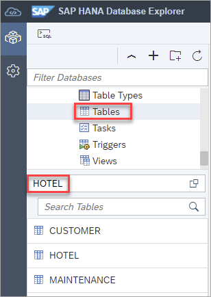

    Alternatively, a table can be found by selecting **Tables** and choosing **Show Tables** from the context menu.
    
    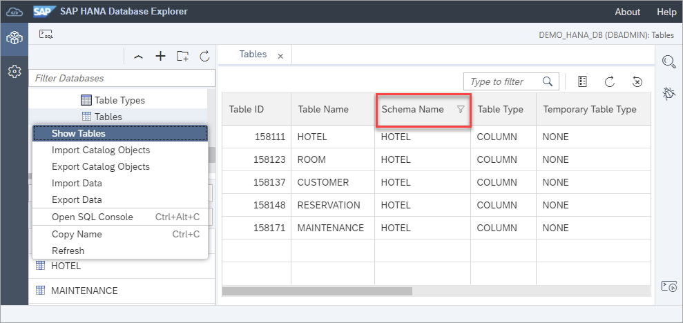

    Additional filters can be applied in this view by clicking on the column header.  A schema filter with a value of HOTEL was applied in the screenshot above.

2. The properties of a selected object such as the RESERVATION table can be viewed by choosing **Open** from a selected table's context menu.

    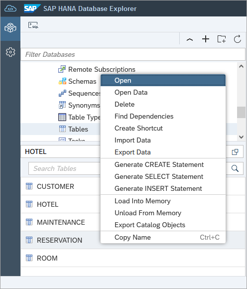

    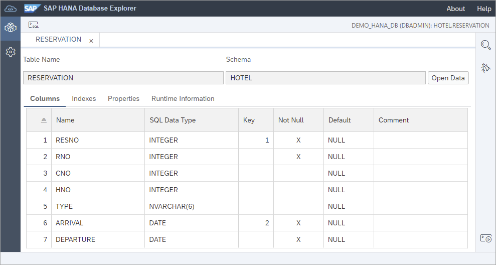

    The runtime information of a table can also be viewed.

    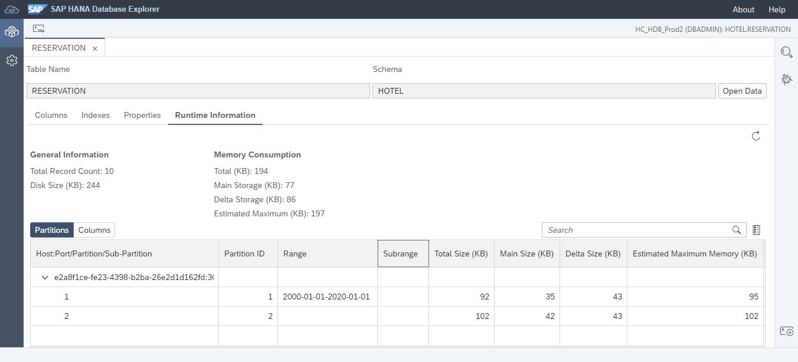

3.  The SQL used to create, select, or insert into a table can be generated via the table's context menu. 

    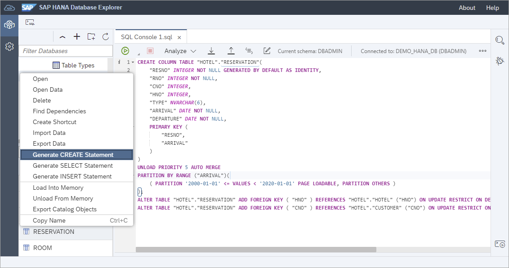

4. The dependencies of an object can be listed.  

    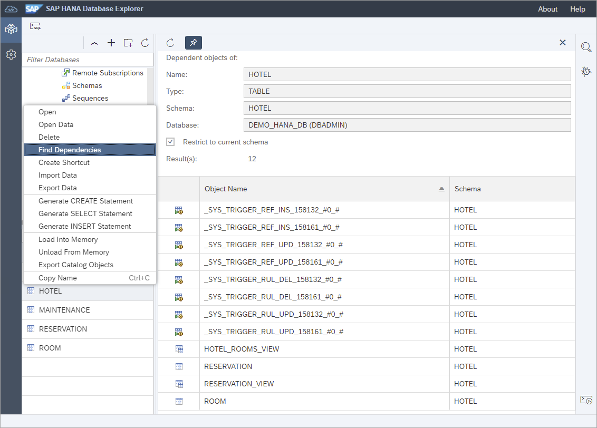

5. Database objects can also be found using the object search.  The below search looks for any functions, procedures, tables, or views in the schema HOTEL in the database DEMO_HANA_DB. 

    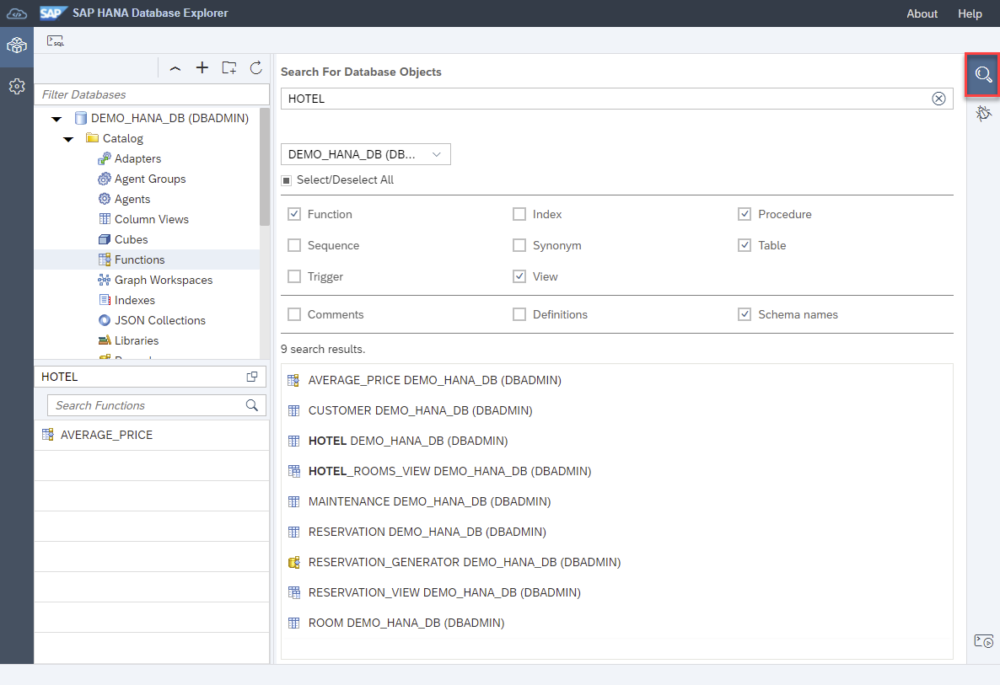

    An object search can be performed across a selected database or across all databases.

    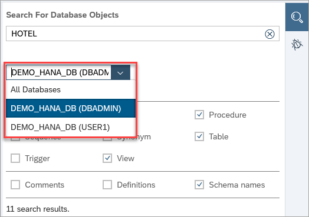

6. An object such as the view RESERVATION_VIEW can opened by clicking on it.  Once it is open, it can be located in the catalog browser by selecting **Display in Database Browser** from the context menu of the tab.

    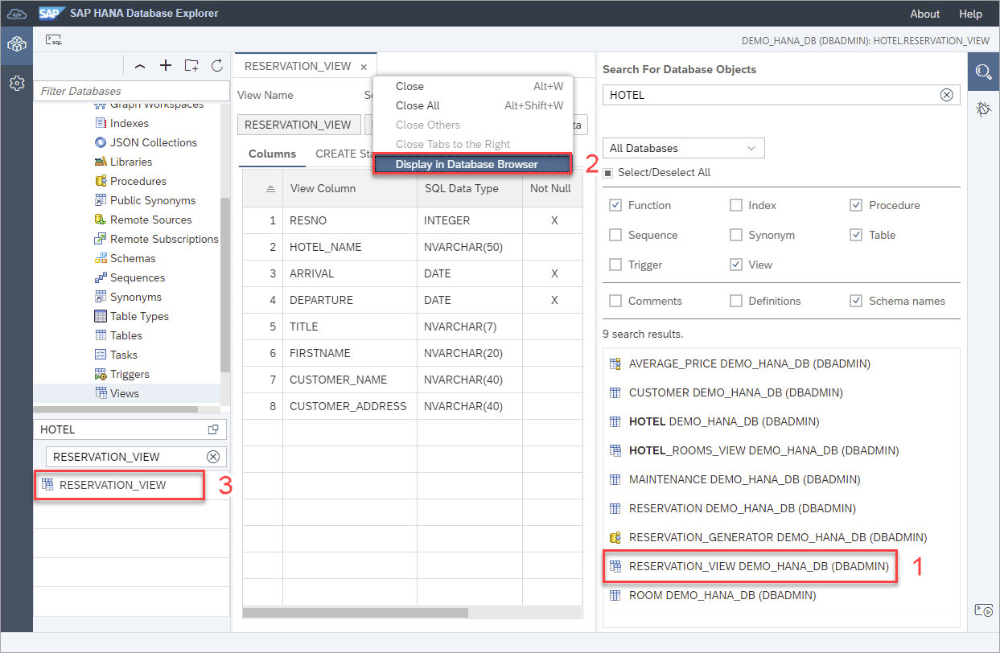

7. Additional functionality is available from the catalog browser such as **Analyze SQLScript Code** which can provide suggestions for code quality, security, or performance and **Open for Debugging** which enables stored procedures, functions or anonymous blocks to be debugged. 

    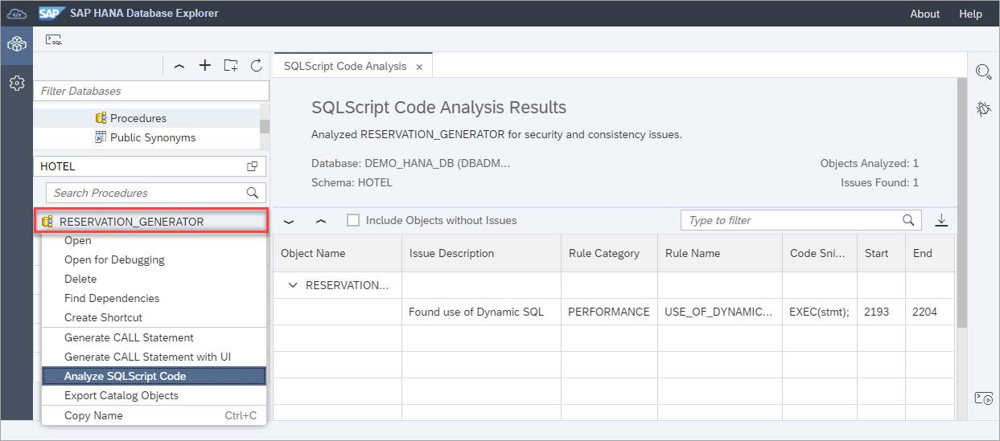

    For additional details on SQLScript analysis and debugging, see [Troubleshoot SQL with SAP HANA Database Explorer](https://developers.sap.com/tutorials/hana-dbx-troubleshooting.html).

This concludes the exercises on the catalog browser and object search.

Continue to - [Exercise 4 - Statement Library ](../ex4/README.md)