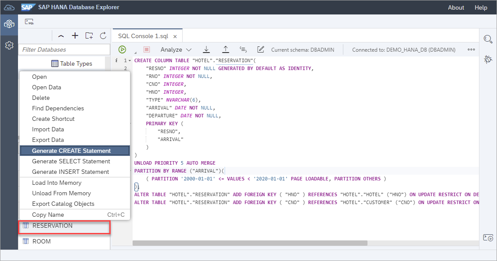
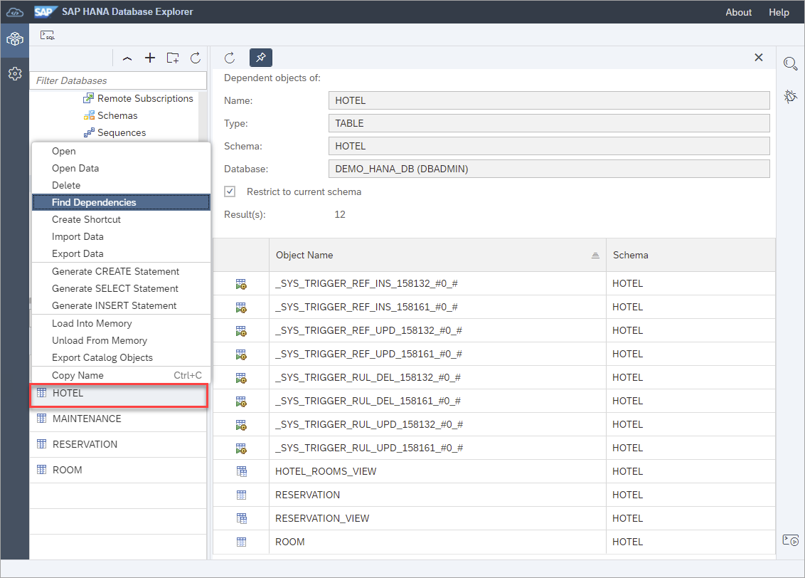

# Exercise 3 - Catalog Browser and Object Search

In this exercise, we will use the catalog browser and the object search to find and view objects.

1. Database objects such as a table can be located in the catalog browser by navigating to **Tables** and specifying a schema such as HOTEL.

    

    Alternatively, a table can be found by selecting **Tables** and choosing **Show Tables**.  Filters can be applied such as specifying HOTEL for the schema name.
    
    

2. The properties of a selected object such as the RESERVATION table can be viewed. 

    

    The runtime information of a table can also be viewed.

    

3.  The SQL used to create, select, or insert into a table can be generated via the table's context menu. 

    

4. The dependecies of an object can be listed.  

    

5. Database objects can also be found using the object search.

    

    An object search can be performed across a selected database or across all databases.

6. Additional functionality is available from the catalog browser such as analyze SQL Script, debugging, and ... 

    