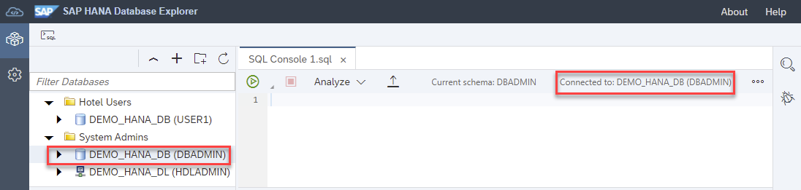
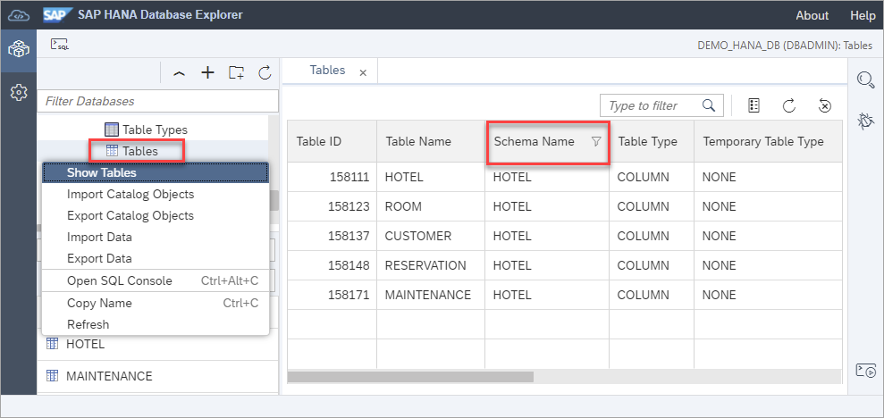
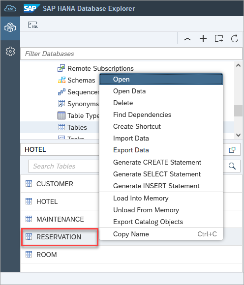
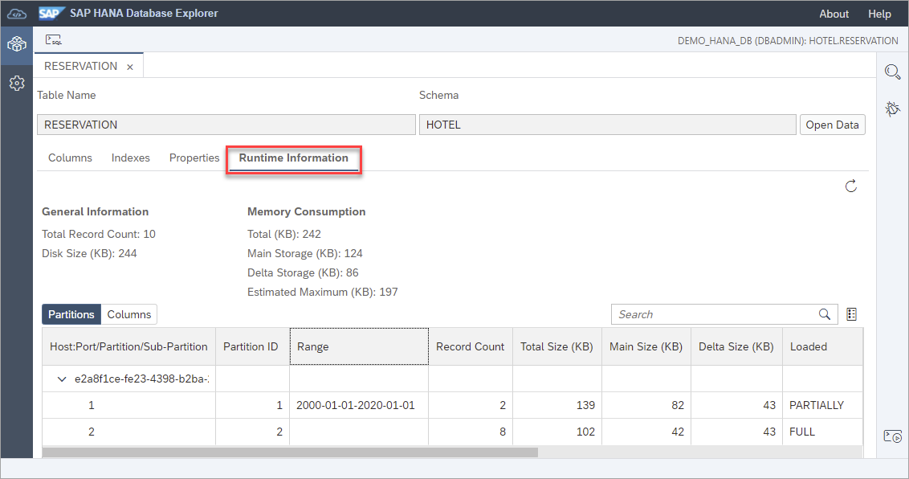
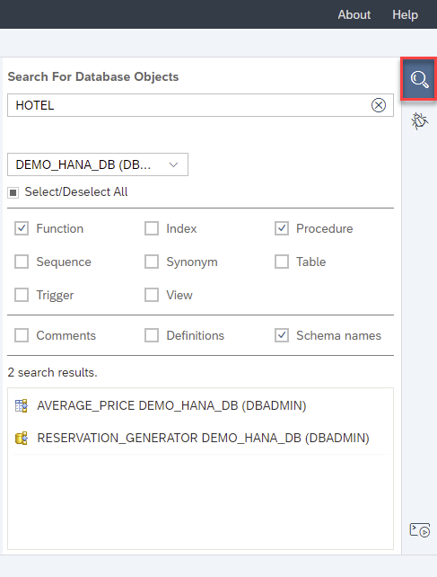
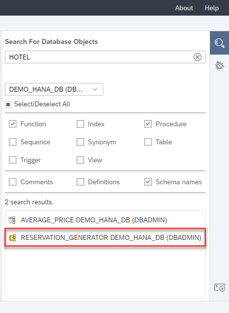
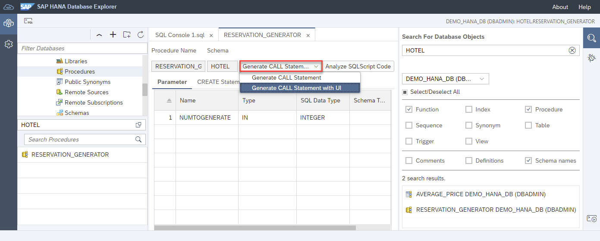
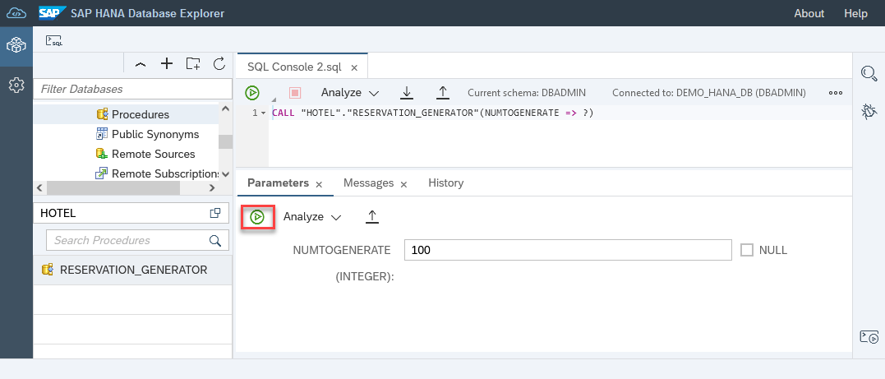

# Exercise 3 - Catalog Browser and Object Search

In this exercise, we will explore some of the functionality that the catalog browser and object search provide when working with database objects.  

>For this exercise and the remaining exercises please use the DBADMIN user.  
>
> 

1. Database objects such as a table can be located in the catalog browser by navigating to **Tables** and specifying a schema such as **HOTEL**.

    

    Alternatively, a table can be found by selecting **Tables** and choosing **Show Tables** from the context menu.
    
    

    Additional filters can be applied in this view by clicking on the column header.  A schema filter with a value of HOTEL was applied in the screenshot above.

2. The properties of a selected object such as the RESERVATION table can be viewed by choosing **Open** from a selected table's context menu.

    

    The table information is displayed.

    

    The runtime information of a table such as the number of records, or the memory consumption can also be viewed.

    

3.  The SQL used to create, select, or insert into a table can be generated via the table's context menu. 

    

4. The dependencies of an object can be shown.  As an example, the ROOM table is shown below as it has a foreign key reference to the HOTEL table. 

    

5. Database objects can also be found using the object search.  The below search looks for any functions or procedures in the schema HOTEL in the database DEMO_HANA_DB (DBADMIN). 

    

    An object search can be performed across a selected database or across all databases.

    

6. An object such as the stored procedure RESERVATION_GENERATOR can be opened by clicking on it.  

    

    Once opened, notice that there is an option to call the stored procedure.

    

    This stored procedure takes an input parameter and when executed will generate 100 new reservations.
 
    

7. Additional functionality is available from the context menu of a stored procedure such as **Analyze SQLScript Code** which can provide suggestions for code quality, security, or performance and **Open for Debugging** which enables stored procedures, functions, or anonymous blocks to be debugged. 

    

    For additional details on SQLScript analysis and debugging, see [Troubleshoot SQL with SAP HANA Database Explorer](https://developers.sap.com/tutorials/hana-dbx-troubleshooting.html).

This concludes the exercises on the catalog browser and object search.

Continue to - [Exercise 4 - Working with the Statement Library ](../ex4/README.md)