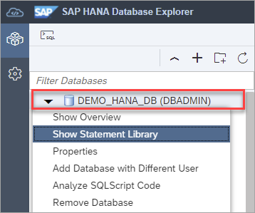
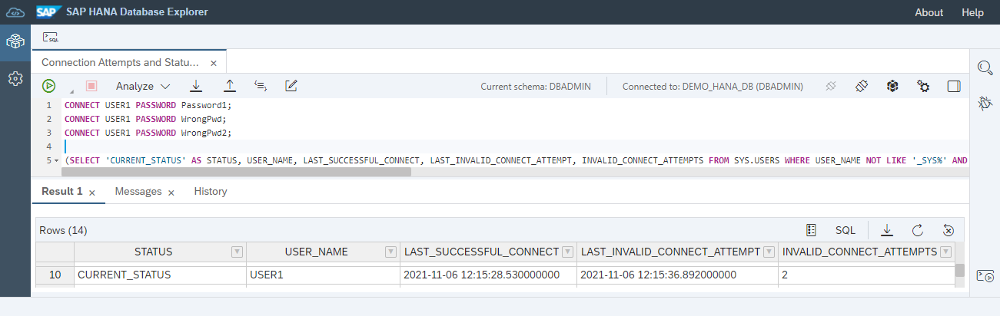
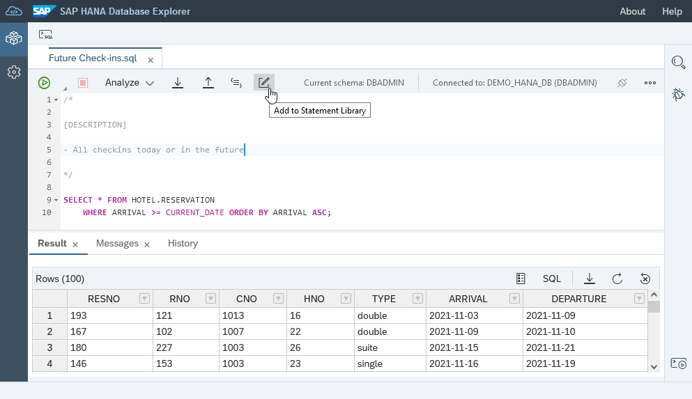
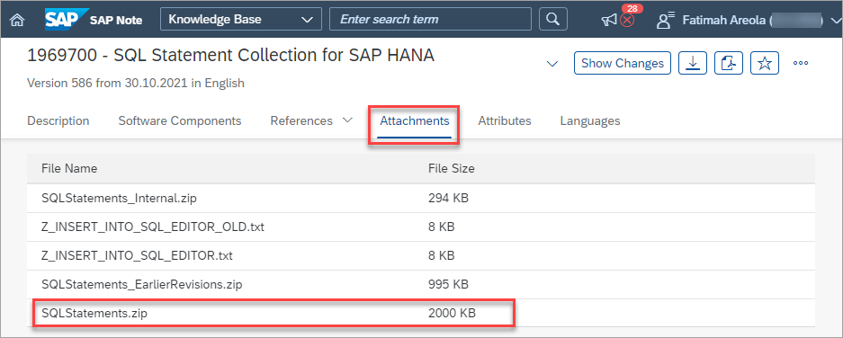

# Exercise 4 - Statement Library

In this exercise, we will explore the statement library and demonstrate how to import and run statements from the SQL Statement Collection for SAP HANA. 

1. The statement library can be accessed by the context menu on the database.

    

    The statement library is associated with the user used to log into the SAP BTP Cockpit.

2. Statements can be either system or user statements.  System statements are not editable and are from the monitoring view M_SYSTEM_INFORMATION_STATEMENTS.

    

    The following is an example result of running the **Connection Attempts and Status** system statement after a successful and then failed connect attempt.

    Future

    ```sql
    CONNECT USER1 PASSWORD Password1;
    CONNECT USER1 PASSWORD WrongPwd;
    ```

3. User statements can be added from the SQL console.

    

    ```sql
    /* 

    [DESCRIPTION]

    - All check-ins today or in the future

    */

    SELECT * FROM HOTEL.RESERVATION
        WHERE ARRIVAL >= CURRENT_DATE ORDER BY ARRIVAL ASC;
    ```

    >Note that the SQL console tab name is used for the name in the statement library.

    

4. A commonly used set of diagnostic SQL statements can be downloaded from [SAP Note 1969700 - SQL Statement Collection for SAP HANA](https://launchpad.support.sap.com/#/notes/1969700).

    

    Once unzipped, it can be seen that there are statements for different versions of SAP HANA. 

    The following steps import statements that apply specifically to SAP HANA Cloud.

    * Create a zip of statements that contain **SHC**.
        
        

    * Import the zip file.

        

        

    * Execute a statement such as the **HANA_Configuration_MiniChecks_SHC**.
    
        

        Notice below that the results shows the value for a check, what the expected range of values is for each check, an X if the value is outside the expected range, and an SAP Note to reference for further information. 

        

This concludes the exercises on the statement library.
    
Continue to - [Exercise 5 - Further Steps with the SAP HANA Database Explorer](../ex5/README.md)