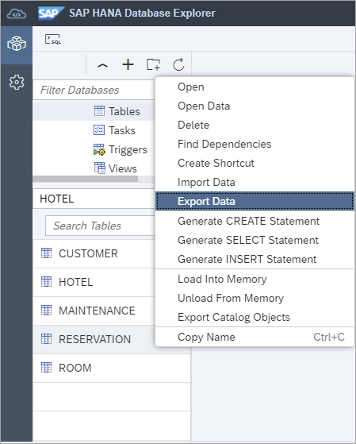

# Exercise 5 - Further Steps with the SAP HANA Database Explorer

In this exercise, we will mention some additional areas of functionality and provide links to where further exercises can be found around the topics of diagnostic files, graph, spatial, import/export, data lake connections, and remote sources.

> Note: The following steps are meant to introduce the topics.  It is not intended that they be completed as activities.

1. Trace file information can be examined using either SQL queries or using the Database Diagnostic Files.  

    

    Execute the following SQL to view the list of available trace files and then to see the contents from a specified trace file.

    > Note: The values for HOST and FILE_NAME used in the second select statement above can be obtained from the results of the first select statement.

    ```SQL
    SELECT * FROM M_TRACEFILES;

    SELECT * FROM M_TRACEFILE_CONTENTS  WHERE HOST = '<host>' AND FILE_NAME='<traceFileName>.trc';

    SELECT DB_USER, SCHEMA_NAME, START_TIME, STATEMENT_STRING, OBJECT_NAME FROM M_EXECUTED_STATEMENTS;
    ```

    Trace files can also be located and browsed under *Database Diagnostic Files*.

     

    Additional instructions showing how to enable a SQL and expensive statement trace are available in the tutorial [Troubleshoot SQL with SAP HANA Database Explorer](https://developers.sap.com/tutorials/hana-dbx-multi-model.html).  For more on executed statement tracing see [SAP Note: 2366291 - FAQ: SAP HANA Executed Statements Trace](https://launchpad.support.sap.com/#/notes/2366291).

2. The SAP HANA database explorer can also work with graph and spatial data.  

    * A graph workspace can be used to visualize vertices and edges such as hotels and the distances between them.  Various filters and algorithms can be applied to a graph.

        
    
        Execute the following SQL to create the graph workspace shown above.

        ```SQL
        CREATE COLUMN TABLE HOTEL.DISTANCES(
            DKEY INTEGER UNIQUE NOT NULL,
            HSOURCE INTEGER NOT NULL
            REFERENCES HOTEL.HOTEL(HNO),
            HTARGET INTEGER NOT NULL
            REFERENCES HOTEL.HOTEL(HNO),
            DIST_KM DOUBLE
        );

        --New York
        INSERT INTO HOTEL.DISTANCES VALUES (3, 12, 13, 217.3);
        INSERT INTO HOTEL.DISTANCES VALUES (4, 13, 12, 217.3);
        INSERT INTO HOTEL.DISTANCES VALUES (5, 12, 14, 71.9);
        INSERT INTO HOTEL.DISTANCES VALUES (6, 14, 12, 71.9);
        INSERT INTO HOTEL.DISTANCES VALUES (7, 12, 15, 71.5);
        INSERT INTO HOTEL.DISTANCES VALUES (8, 15, 12, 71.5);
        INSERT INTO HOTEL.DISTANCES VALUES (9, 13, 14, 212.2);
        INSERT INTO HOTEL.DISTANCES VALUES (10, 14, 13, 212.2);
        INSERT INTO HOTEL.DISTANCES VALUES (11, 13, 15, 212.1);
        INSERT INTO HOTEL.DISTANCES VALUES (12, 15, 13, 212.1);
        INSERT INTO HOTEL.DISTANCES VALUES (13, 14, 15, 0.4);
        INSERT INTO HOTEL.DISTANCES VALUES (14, 15, 14, 0.4);

        CREATE GRAPH WORKSPACE HOTEL.DISTANCEGRAPH
        EDGE TABLE HOTEL.DISTANCES
            SOURCE COLUMN HSOURCE
            TARGET COLUMN HTARGET
            KEY COLUMN DKEY
        VERTEX TABLE HOTEL.HOTEL
            KEY COLUMN HNO;
        ```

        The graph can be viewed via the **View Graph** context menu item on the just created Graph Workspace.

    * The import data wizard can be used to import spatial data from an ESRI shapefile such as the [points of interest for the city of Longview Texas](https://hub.arcgis.com/datasets/longviewtexas::points-of-interest/explore?location=32.489161%2C-94.771600%2C12.10).  
    
        Download a zip file of this data in an ESRI shapefile format.

        

        The import data wizard can be invoked via the context menu from a database connection by choosing **Import Data**. 

        

        Set the schema to HOTEL for the imported table and specify the SRID to be WGS 84.

        

        Execute the following SQL to find the closest points of interest to the Bella Cliente hotel.

        ```SQL
        RENAME TABLE "HOTEL"."Points_of_Interest" TO HOTEL.POI_LONGVIEW;

        SELECT
            P.NAME,
            P.FCODE,
            P.ADDRESS,
            ROUND(H.LOCATION.ST_Distance(P.SHAPE, 'kilometer'), 2) as DISTANCE,
            P.LINKED_URL
        FROM HOTEL.HOTEL H, HOTEL.POI_LONGVIEW P
        WHERE
            H.HNO=26 /*Bella Cliente */ AND
            TO_BOOLEAN(H.LOCATION.ST_WithinDistance(NEW ST_Point(SHAPE.ST_AsWKT(), 4326), 3, 'kilometer')) = TRUE
        ORDER BY DISTANCE ASC;
        ```

         

        Data such as the distance between two points can calculated using spatial methods such [ST_WithinDistance](https://help.sap.com/viewer/bc9e455fe75541b8a248b4c09b086cf5/latest/en-US/7a1cc028787c1014b4afe2c72ff94316.html).

        Step by step instructions on exploring multi-model functionality is available in the tutorial [Try Out Multi-Model Functionality with the SAP HANA Database Explorer](https://developers.sap.com/tutorials/hana-dbx-multi-model.html).

3. The SAP HANA database explorer provides wizards that can be used to export or import data from a single table or view.  

    When using a SAP HANA Cloud, SAP HANA database, the data can be stored on cloud storage providers in CSV or parquet formats.  

    The following screenshots are meant to introduce the topic.  A complete example is available in the tutorial [Export and Import Data and Schema with SAP HANA Database Explorer](https://developers.sap.com/tutorials/hana-dbx-export-import.html).

    

    

4. Multiple objects can be exported or imported at one time using the catalog export and import wizards.  A catalog export also includes the SQL to create the exported objects.

    

    
    
5. The database explorer can be used to connect to, browse the database catalog, and execute SQL queries against a data lake IQ.  

    

    If you have a data lake IQ, a database connection can be created to it as shown below.

    

    The following SQL statement will create a table to store customer reviews. 

    ```SQL
    CREATE TABLE TOURIST_REVIEWS (
        REVIEW_ID INTEGER PRIMARY KEY,
        REVIEW_DATE DATE NOT NULL,
        DESTINATION_ID INTEGER,
        DESTINATION_RATING INTEGER,
        REVIEW VARCHAR(500) NOT NULL
    );

    INSERT INTO TOURIST_REVIEWS(REVIEW_ID, REVIEW_DATE, DESTINATION_ID, DESTINATION_RATING, REVIEW) VALUES(1, '2019-03-15', 1, 5, 'We had a great day swimming at the beach and exploring the beach front shops.  We will for sure be back next summer.');

    INSERT INTO TOURIST_REVIEWS(REVIEW_ID, REVIEW_DATE, DESTINATION_ID, DESTINATION_RATING, REVIEW) VALUES(2, '2019-02-02', 1, 4, 'We had an enjoyable meal.  The service and food was outstanding.  Would have liked to have slightly larger portions');
    ```

6. Remote sources can be defined to connect to other data sources such as a data lake or an on-premise SAP HANA database from an SAP HANA Cloud, SAP HANA database.  

    The following SQL statement executed in a SQL Console connected to an SAP HANA Cloud database creates a remote source to a data lake IQ.

    ```SQL
    CREATE REMOTE SOURCE HC_DL_Trial
	ADAPTER "IQODBC"
		CONFIGURATION 'Driver=libdbodbc17_r.so;host=XXXXXXXX-XXXX-XXXX-XXXX-XXXXXXXXXXXX.iq.hdl.trial-XXXX.hanacloud.ondemand.com:443;ENC=TLS(tls_type=rsa;direct=yes)'
			WITH CREDENTIAL TYPE 'PASSWORD'
				USING 'user=HDLADMIN;password=myPassword1';
    CALL PUBLIC.CHECK_REMOTE_SOURCE('HC_DL_TRIAL');
    ```

    

    >The host value can be found in the properties of the data lake IQ database connection.

    Once a remote source is created, virtual tables can be created that enable access to data that is stored in the remote system from the SAP HANA Cloud database.

    

    A name for the virtual table and the schema to create it in can be specified.

    

    Once created, it can be queried as shown below.

    

    ```SQL
    SELECT * FROM HOTEL.VT_TOURIST_REVIEWS;
    ```

    Further details on this topic can be found in the tutorial [Access Remote Sources with SAP HANA Database Explorer](https://developers.sap.com/tutorials/hana-dbx-remote-sources.html).

This concludes the exercises on the SAP HANA database explorer.

Return to - [Get Hands-On Experience with Administering and Operating SAP HANA Cloud [DAT261]](../../../README.md)