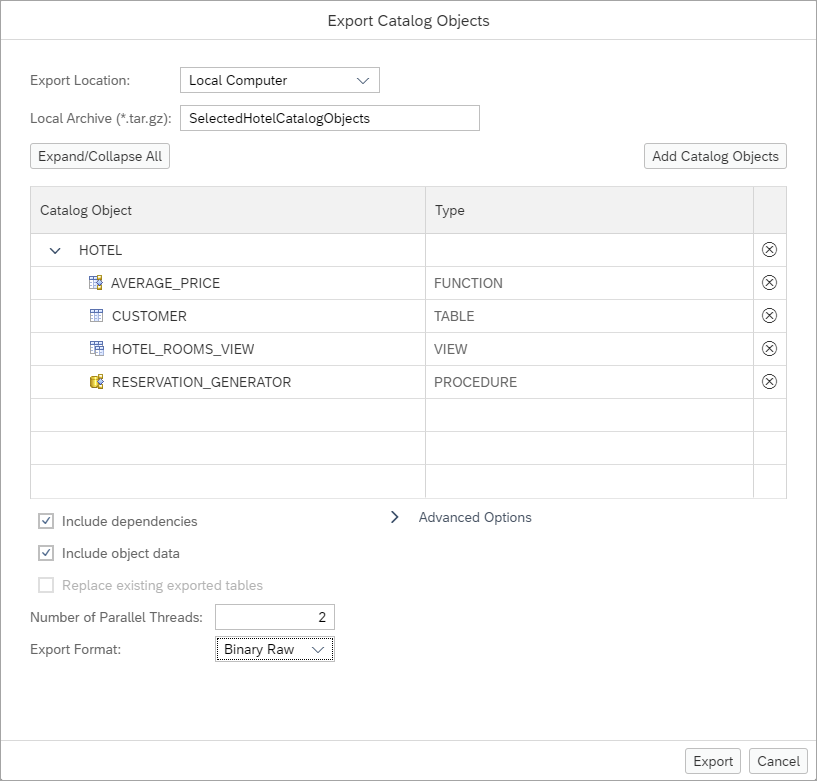
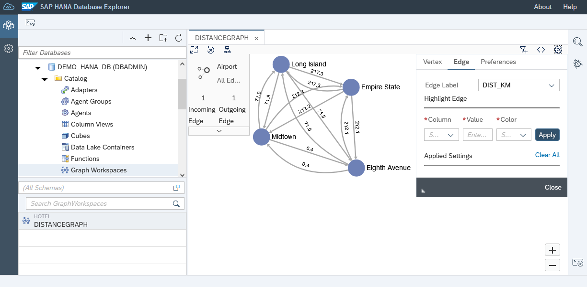

# Exercise 5 - Further Steps with the SAP HANA Database Explorer

In this exercise, we will mention some additional areas of functionality and where further exercises can be found.   

1. The SAP HANA database explorer provides wizards that can be used to export or import data from a table or view.    When using a SAP HANA Cloud, SAP HANA database, the data can be stored on cloud storage providers in CSV or parquet formats.  

    

    

    

2. Multiple objects can be exported or imported at one time using the catalog export and import wizards.  A catalog export also includes the SQL create the exported objects.s

    

    
    
    Step by step instructions on performing data and catalog export and imports is available in the tutorial [Export and Import Data and Schema with SAP HANA Database Explorer](https://developers.sap.com/tutorials/hana-dbx-export-import.html).


3. Trace file information can be found using either SQL queries or using the Database Diagnostic Files.  

    

    ```SQL
    SELECT * FROM M_TRACEFILES;

    SELECT * FROM M_TRACEFILE_CONTENTS  WHERE HOST = '3a2ef55e-4214-4bd9-adfc-f547d8e2d384' AND FILE_NAME='indexserver_3a2ef55e-4214-4bd9-adfc-f547d8e2d384.30040.000.trc';

    SELECT DB_USER, SCHEMA_NAME, START_TIME, STATEMENT_STRING, OBJECT_NAME FROM M_EXECUTED_STATEMENTS;
    ```

     

    Additional instructions showing how to enable a SQL and expensive statement trace are available in the tutorial [Troubleshoot SQL with SAP HANA Database Explorer](https://developers.sap.com/tutorials/hana-dbx-multi-model.html).  For more on executed statement tracing see [SAP Note: 2366291 - FAQ: SAP HANA Executed Statements Trace](https://launchpad.support.sap.com/#/notes/2366291).

4. The SAP HANA database explorer can also work with graph and spatial data.

    * A graph workspace can be used to visualize vertices and edges such as hotels and the distances between them in a given state.  Various filters and algorithms can be applied to a graph.

    

    * The import data wizard can be used to import spatial data from an ESRI shapefile.  The data can be queried using spatial functions.

    

     

    ```SQL
    RENAME TABLE "HOTEL"."Points_of_Interest" TO HOTEL.POI_LONGVIEW;

    SELECT
        P.NAME,
        P.FCODE,
        P.ADDRESS,
        ROUND(H.LOCATION.ST_Distance(P.SHAPE, 'kilometer'), 2) as DISTANCE,
        P.LINKED_URL
    FROM HOTEL.HOTEL H, HOTEL.POI_LONGVIEW P
    WHERE
        H.HNO=26 /*Bella Cliente */ AND
        TO_BOOLEAN(H.LOCATION.ST_WithinDistance(NEW ST_Point(SHAPE.ST_AsWKT(), 4326), 3, 'kilometer')) = TRUE
    ORDER BY DISTANCE ASC;
    ```

    Step by step instructions on exploring multi-model functionality is available in the tutorial [Try Out Multi-Model Functionality with the SAP HANA Database Explorer](https://developers.sap.com/tutorials/hana-dbx-multi-model.html).

5. Finally, remote sources can be defined to connect to other data sources such as an on-premise SAP HANA database.  

    

    Once a remote source is created, virtual tables can be created that enable access to data that is stored in the remote system.

    

    Step by step instructions on connecting between SAP HANA on-premise and SAP HANA Cloud, SAP HANA databases and from an SAP HANA Cloud database to an SAP HANA Cloud, data lake can be found in the tutorial [Access Remote Sources with SAP HANA Database Explorer](https://developers.sap.com/tutorials/hana-dbx-remote-sources.html).

This concludes the exercises on the SAP HANA database explorer.

Return to - [Get Hands-On Experience with Administering and Operating SAP HANA Cloud [DAT261]](../../README.md)