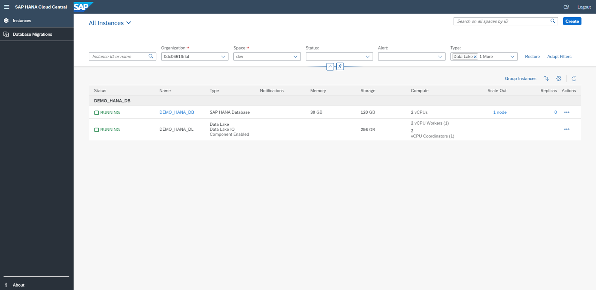

# Getting Started: Launching SAP HANA Cloud Central

1. Open SAP BTP Cockpit -> Go to any SAP HANA instance -> Click the “Actions” button from an instance tile -> Click on "Open in SAP HANA Cloud Central"
    <kbd>
    
    </kbd>

2. SAP HANA Cloud Central is launched in a new tab.
    <kbd>
    
    <kbd>

Continue to - [Exercise 1 - Apply Filters](../ex1/README.md)
