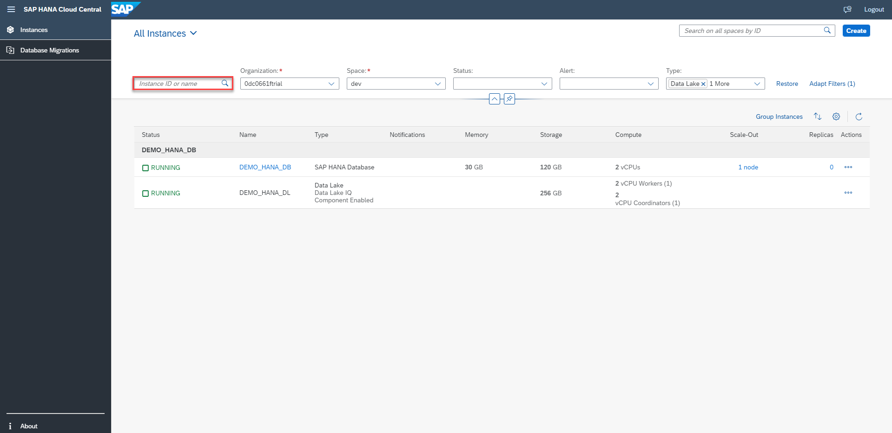
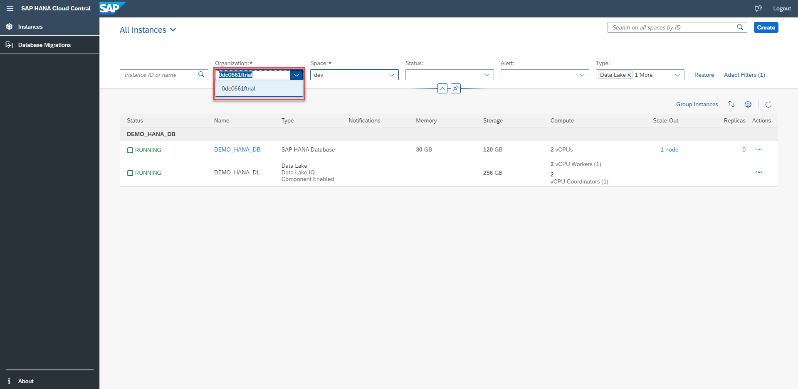
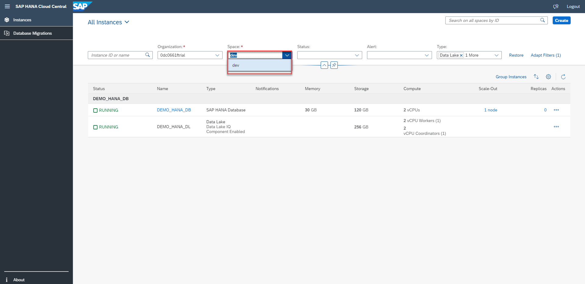
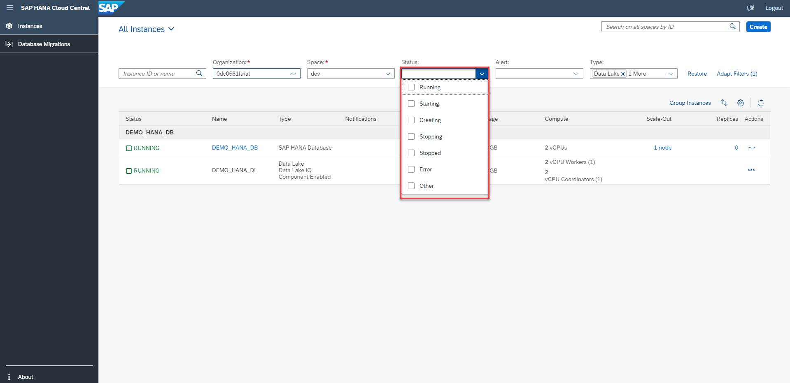
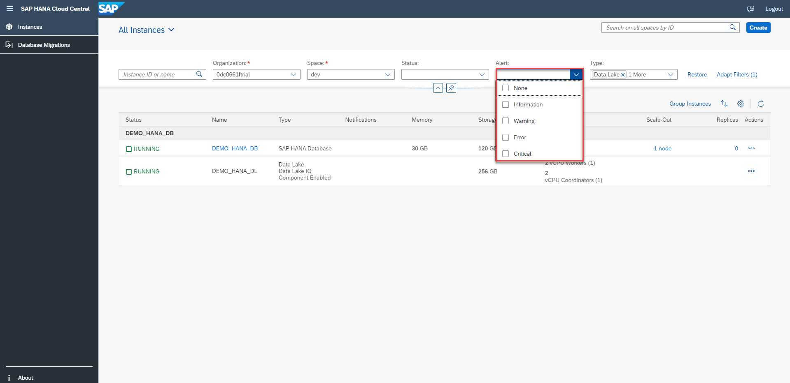
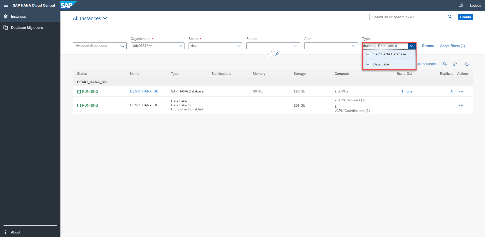
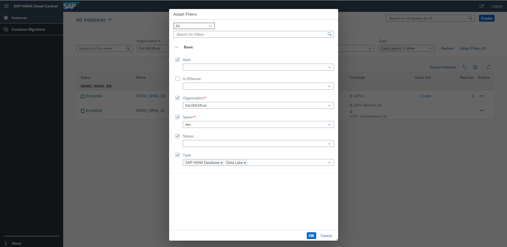
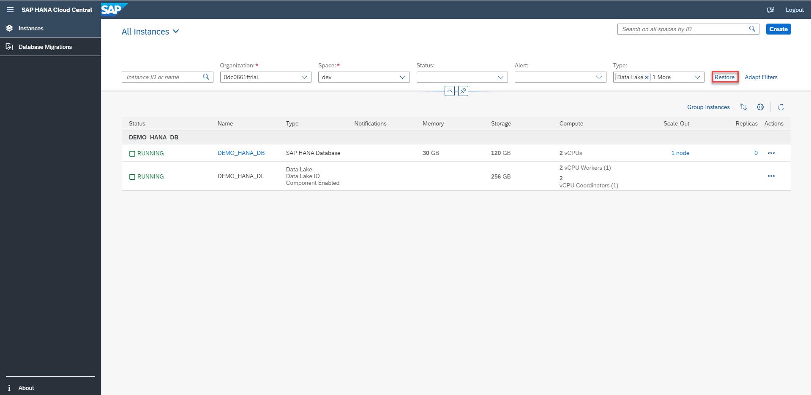
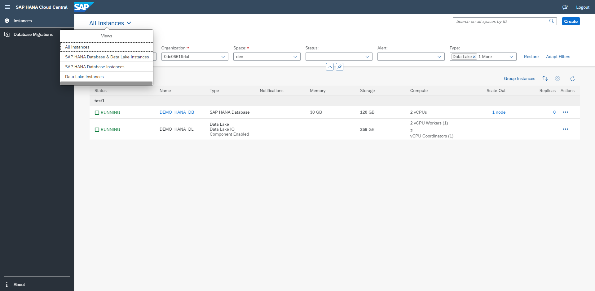
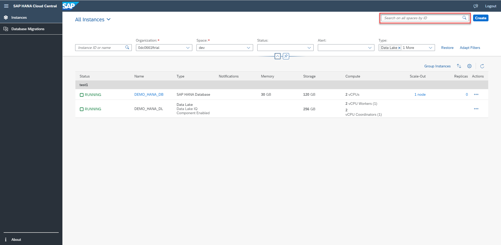

# Exercise 1 - Apply Filters

In this exercise, we will filter the instances based on their properties.

1. Click on the Instance ID or Name field. If you are already aware of the Instance ID or Name of the instance, then you can put it in here and you will see only the respective instance in the list. 

 

2. Click on the "Organization" dropdown to see various organizations you are part of or the organizations you have access to.

 

3. Click on the "Space" dropdown button to see list of all the spaces you can access. We can filter out instances based on various "Space" under a selected "Organization". Choosing any of the listed Space will then display only the instances under the respective Space chosen.

 

4. Instances can also be filtered based on the Status of the instance. On clicking the "Status" dropdown button, we can see list of various statuses from which the users can choose one or many statuses based on which they need their search results. The various instance statuses are: Running, Starting, Creating, Stopping, Stopped, Error, Other.
For example - If the user wants to see a list of instances that are still being created, he can choose the check box corresponding to 'Creating'. 

 

5. The instances can be filtered based on their respective alerts. On clicking the dropdown button, we can see list of various alerts from which the users can choose one or many alerts based on which they need their search results. The alerts on which filtering can be performed are: None, Information, Warning, Error, and Critical.
For example - If the user wants to see list of instances with the alert 'None', he can choose the checkbox corresponding to the 'None' option in the dropdown.

 

6. The instances can also be filtered based on type of the instances. From the "Type" dropdown field, you can either choose to see only 'SAP HANA Database' instances or 'Data Lake' instances or both.

 

7. More of the modifications to the filtering of instances can be done by clicking on the "Adapt Filters" option. A pop up opens with similar options to filtering that were earlier discussed.

 

8. Modifications to the filtering of instances can be restored by clicking on the "Restore" option. 

 

9. Click on the drop down next to the "All Instances" title. You can see four options in the popover that opens up which can also be used for filtering.

 

10. There is one more search field beside "Create" button which could be used to search instances from all the spaces using Instance ID.

 

Continue to - [Exercise 2 - Create Instances](../ex2/README.md)

