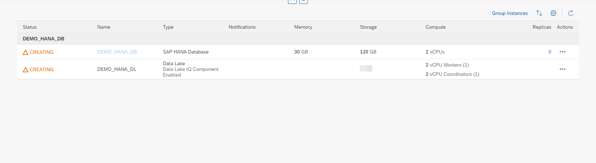

# Exercise 2 - Creating Instances

We can create SAP HANA, Data Lake, Adaptive Server Enterprise, and Adaptive Server Enterprise Replication instances directly from the SAP BTP Cockpit page or from the SAP HANA Cloud Central Overview page.
Note - You can see the options to create ASE and ASE Replication instances only if you have subscribed to use them.

1. Click Create button in the BTP Cockpit page to see the list of instance types that you can create. First let us create an SAP HANA Database Instance. 

 

You can also create instances from the SAP HANA Cloud Central application. You will see same options when you click Create Instance button in the SAP HANA Cloud Central application. Both Create buttons will navigate you to the create instance page.

 

Click on SAP HANA Database option. The below screen appears if you proceed with the option of creating SAP HANA Database instance. On this screen, we see information corresponding to certain fields.

 

2. Below are the details on the fields that you see on this Create Instance pop up, what are the values they take and the details on steps to successfully create an SAP HANA Cloud instance.
Organization - The Cloud Foundry organization in which the instance is created
Space - The Cloud Foundry space in which the instance is created
Instance Name - The name of the instance. The name must start and end with an alphanumeric character. The name can include the underscore character _.
Description - A description of the instance.
Administrator Password - The password of the database 'superuser' DBADMIN. The password must have at least 8 characters and comprise at least one uppercase letter, two lowercase letters, and at least one number. The password must not include the user name, the characters ' " ` \ ; [ ], or control characters, such as newline, backspace, tab.
Click on Next Step once all the fields are rightly filled. 
 
 

3. Click on SAP HANA Database Documentation hyperlink. Here is the look of new tab that has details on the database instance sizes.
Further details on the fields present on step 2 are as below:
Memory - The size of your (compressed) in-memory data in your SAP HANA database
Compute - The number of vCPUs of your SAP HANA database
The number of vCPUs is allocated according to the size of memory of your instance.
Storage - The disk storage space of your SAP HANA database.
The disk storage space is allocated according to the memory size of your SAP HANA database.

 

4. Click on Next Step button, once the memory and storage configurations are done. In this step, you have an option to choose availability zones.

 

5. Click on Next Step butto. Here, you have an option to make configurations related to allowed connections like IP address settings. Then there is an Additional Features sections to make configurations on Script Server and Document Store capabilities.

 

6. Click on Next Step to proceed to Data Lake related settings. In this step, you have the option to create a data lake instance along with creating an SAP HANA Cloud instance. To do so, you must just enable the Create Data Lake toggle button and fill in related details to it.

 

7. Click on Create Data Lake toggle button to create a Data Lake instance as well. Enter the Data Lake instance name, make configurations to the required Storage services. Click on Next Step.

 

8. Adjust the size if necessary and click on Next Step. This section will have enabled fields only if we choose to create a Data Lake IQ instance in the previous step. Here you have the liberty to make configurations on the IP address settings as per your requirements.

 

 

9. Click on Review and Create Instance button. You can noew review the instance details in this page.

 

10. Click on Create Instance button and you will be redirected to the SAP Cloud Central overview page to see the instance you have just initiated to create.

 

11. On the Cloud Central overview page, after the SAP HANA instance is created, we see a status CREATING next to the instance we just created. 

 

 

12. On clicking on this status (hyperlink) we get details on when the instance creation was initiated. Once the instance is created, status will be changed to Running.

 

 

 

Continue to - [Exercise 3 - Edit Instances ](../ex_3/README.md)
