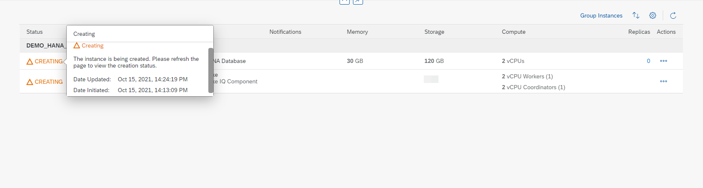

# Exercise 2 - Creating Instances

We can create SAP HANA Database, Data Lake, Adaptive Server Enterprise, and Adaptive Server Enterprise Replication instances directly from the SAP BTP Cockpit page or from the SAP HANA Cloud Central Overview page.
Note - You can see the options to create ASE and ASE Replication instances only if you have subscribed to use them.

1. Click Create button in the BTP Cockpit page to see the list of instance types that you can create. 
    <kbd>
    
    </kbd>
    
    You can also create instances from the SAP HANA Cloud Central application. Both Create buttons will navigate you to the create instance page.
    <kbd>
    
    </kbd>
    
    In this page, you can see four options: [1] SAP HANA Cloud, SAP HANA Database [2] SAP HANA Cloud, Data Lake [3] SAP HANA Cloud, Adaptive Server Enterprise [4] SAP HANA    Cloud, Adaptive Server Enterprise Replication. You can choose the type of instance you would like to create and click on 'Next Step'. In this exercise, let us focus on creating an SAP HANA Cloud, SAP HANA Database instance. 
    <kbd>
    
    </kbd>
    
2. Below are the details on the fields that you see on this Create Instance screen, what are the values they take and the details on steps to successfully create an SAP HANA Cloud instance.
Organization - The Cloud Foundry organization in which the instance is created.
Space - The Cloud Foundry space in which the instance is created.
Instance Name - The name of the instance. The name must start and end with an alphanumeric character. The name can include the underscore character _.
Description - A description of the instance.
Administrator Password - The password of the database 'superuser' DBADMIN. The password must have at least 8 characters and comprise at least one uppercase letter, two lowercase letters, and at least one number. The password must not include the user name, the characters ' " ` \ ; [ ], or control characters, such as newline, backspace, tab.

    Click on Next Step once all the fields are rightly filled. 
    <kbd>
    
    </kbd>
    
3. You can navigate to the SAP HANA Database Documentation by clicking on the hyperlink.

Details of the fields that you see on this screen:
Memory - The size of your (compressed) in-memory data in your SAP HANA database.
Compute - The number of vCPUs of your SAP HANA database.
The number of vCPUs is allocated according to the size of memory of your instance.
Storage - The disk storage space of your SAP HANA database.
The disk storage space is allocated according to the memory size of your SAP HANA database.

    You can also use the SAP HANA Cloud Capacity Unit Estimator to estimate the number of Capacity Units(CU) required for your particular use case. 
    <kbd>
    
    </kbd>
    
    <kbd>
    
    </kbd>
    
4. Click on Next Step button, once the memory and storage configurations are done. In this step, you have an option to choose availability zones. You cannot change the availability zone of an instance once it is created. If you want to change the availability zone for an instance, delete the instance and re-create it with the preferred availability zone.
    <kbd>
    
    </kbd>
    
5. Click on Next Step button. Here, you have an option to make configurations related to allowed connections like IP address settings. Then there is an Additional Features sections to make configurations on Script Server and Document Store capabilities.
    <kbd>
    
    </kbd>
    
6. Click on Next Step to proceed to Data Lake related settings. In this step, you have the option to create an SAP HANA Cloud, data lake instance along with creating an SAP HANA Database instance. To do so, you must enable the Create Data Lake toggle button and fill in the related details.
    <kbd>
    
    </kbd>
    
7. After clicking on Create Data Lake toggle button, enter the Data Lake instance name, make configurations to the required Storage services. Click on Next Step.
    <kbd>
    
    </kbd>
    
8. Adjust the size if necessary and click on Next Step.
    <kbd>
    
    </kbd>
    
    Here you have the liberty to make configurations on the IP address settings as per your requirements. You can choose to only allow access to the instance from SAP Business Technology Platform (default) or only from trusted IP addresses by specifying IP address filter ranges. Up to 45 entries can be specified. Click on Review and Create button.
    <kbd>
    
    </kbd>
    
9. You can now review the instance details in this page.
    <kbd>
    
    </kbd>
    
10. Click on Create Instance button and you will be redirected to the SAP Cloud Central overview page to see the instance you have just initiated to create.
    <kbd>
    
    </kbd>
    
    <kbd>
    
    </kbd>
    
11. On the Cloud Central overview page, we see a status CREATING next to the instance we just initiated to create. 
    <kbd>
    
    </kbd>
    
12. By clicking on this status (hyperlink) we get details on when the instance creation was initiated. Once the instance is created, status will be changed to Running.
    <kbd>
    
    </kbd>
    
    <kbd>
    
    </kbd>
    
Continue to - [Exercise 3 - Edit Instances ](../ex_3/README.md)
