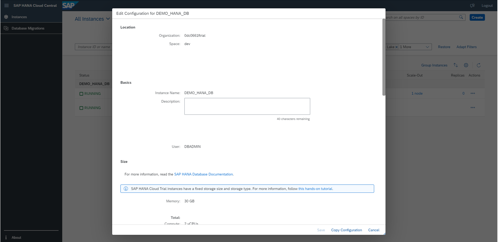
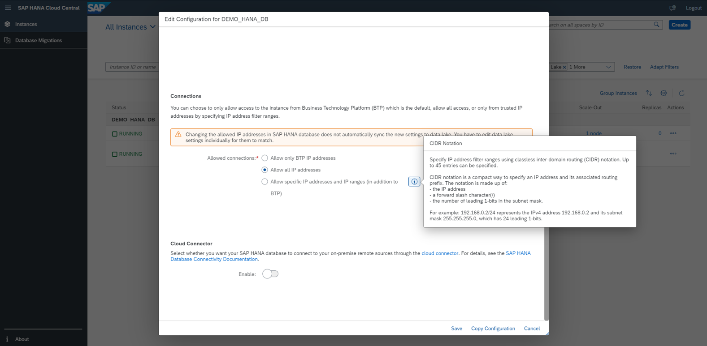
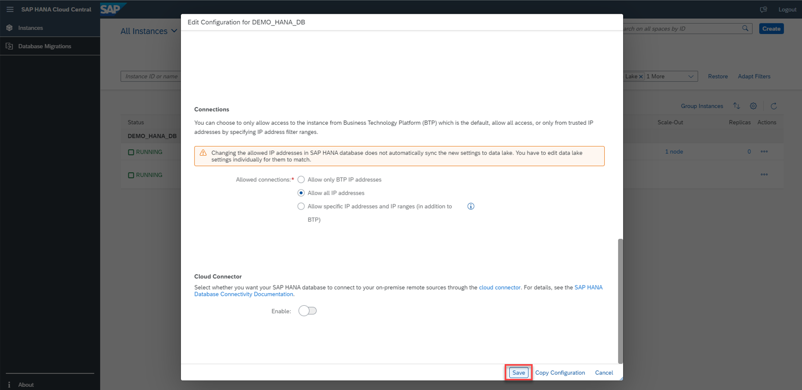
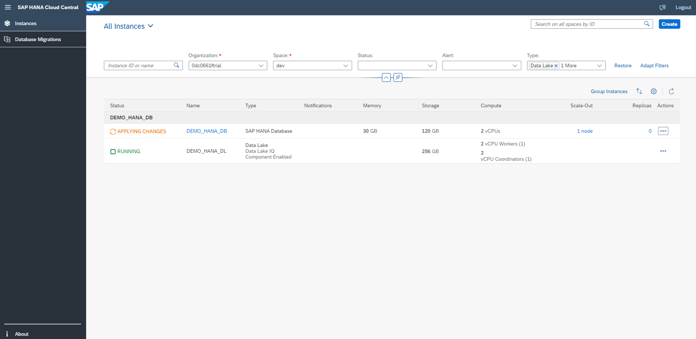
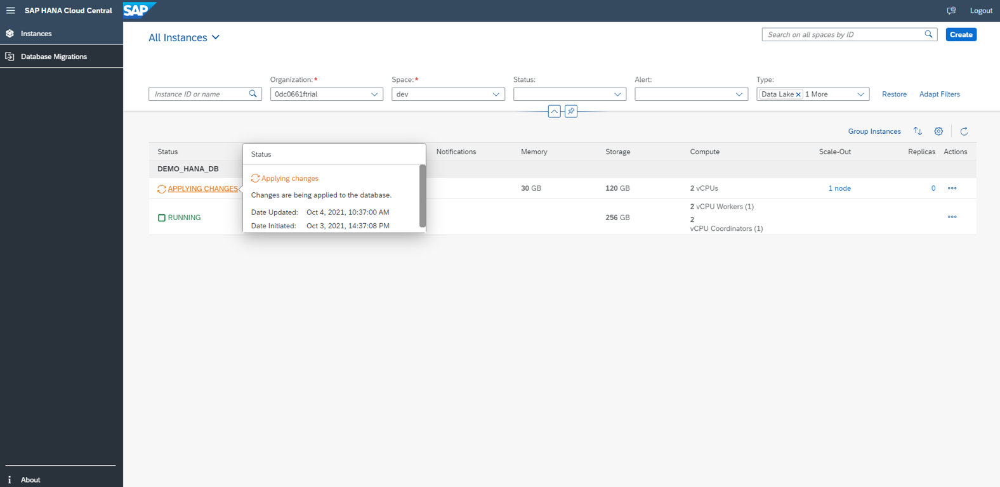

# Exercise 3 - Edit Instances

In this chapter, we will discuss about the Edit functionality across all the instance types. An existing instance can be modified later as per requirement through the Edit functionality. Let us start by editing a SAP HANA instance first.

1. Click on the '...' icon to see the list of Actions that can be performed on an SAP HANA instance. Click on Edit.

 

2. An Edit instance pop up opens and you can see all the relevant fields that can be modified. These are the similar field that we already discussed while we created the instance.

 

3. As we scroll down the pop up, we see other fields that we can edit. Also, we can notice that, there are help icons that will lead to more details like what values the fields can take, what settings are preferable etc.

 

4. Once necessary changes are made, click on Save button.

 

5. On the SAP HANA Cloud central Overview page, you can see that the recently edited instance is now in status ‘Applying Changes’. The edited instance is restarting to adapt itself to the recently made changes.

 

 

Continue to - [Exercise 4 - Grouping, Sorting, and Other Settings ](../ex_4/README.md)
