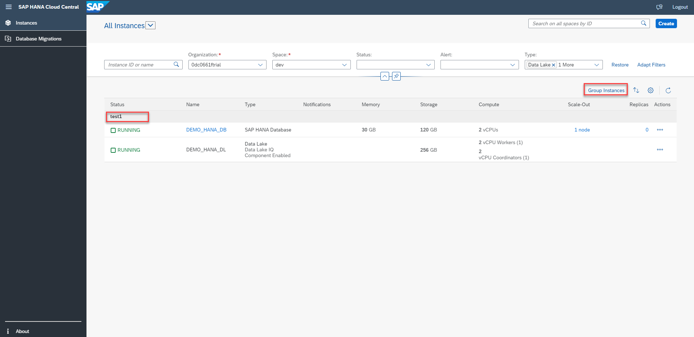
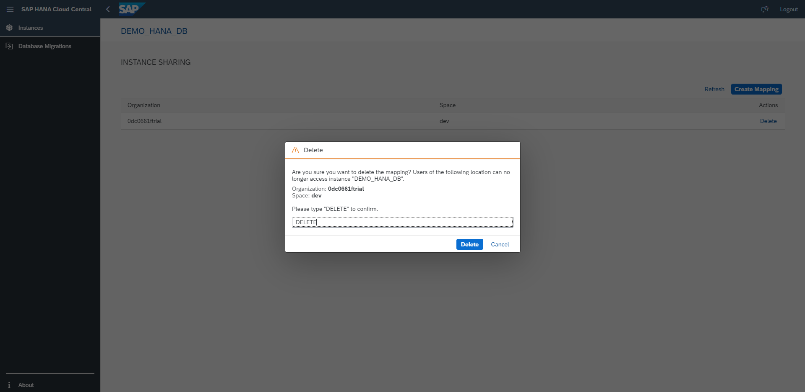

# Exercise 4 - Grouping, Sorting, and Other Settings

In this section, we will discuss about grouping, sorting, refreshing and other settings available for table of instances in SAP HANA Cloud Central.
 
To start with, we can see buttons and icons for grouping, sorting, personalization settings and refreshing at the right top corner of the table of instances. These functions can be directly operated from this page.

 

1. Click on Group Instances. All the SAP HANA Database instances and their managed data lake instances get grouped under the respective description of the SAP HANA Database instance.

 

2. Click on Sort icon. A Sort pop up opens up, where we can make modifications with respect to sort order and sort by properties.

 

3. Click on Personalize Table icon to modify which columns you would like to display and which columns you want to hide from the table.

 

4. Click on Refresh icon. This button refreshes the entire page and the most recent data appears on the screen.

 

 

5. Instance Sharing: Click on the name of the SAP HANA Database instance which is a hyperlink. This will navigate you to the instance sharing page. When an SAP HANA Cloud instance is created, only the space it is located in can access it and use it for service bindings. However, you can change this, and grant other spaces controlled access to the database instance. The space can be part of the same or a different organization. You can share an instance with multiple spaces in different organizations by creating a mapping.

 

6. Click on Create Mapping.

 

7. A popup opens where you have to enter Organization and Space. Click on Add.

 

8. You can delete the mapping that is created using the delete button.

 

9. Confirm by typing DELETE in the popup that opens up.

 

10. You can click on the Scale-Out node hyperlink and edit storage size.

 

11. Click on Save button to save your changes.

 

12. Click on the hyperlink available in the Replicas column. A popover appears with two buttons: Manage Services and Edit Replicas.

 

13. Manage Service button will navigate you to the SAP HANA Cockpit.

 

14. Edit Replicas will open up the edit dialog where you can add replicas using Add button. Click on Save button to save your changes.

 

Continue to - [Exercise 5 - Start, Stop, Upgrade Instances, and Other Actions ](../ex_5/README.md)
