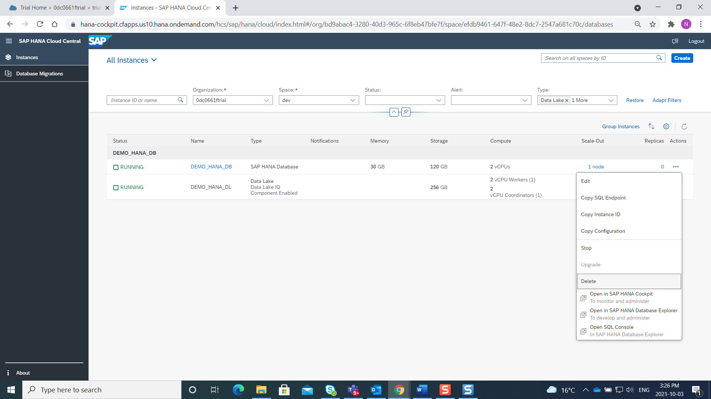
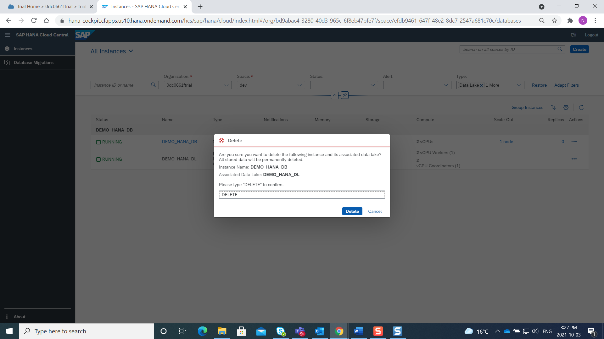
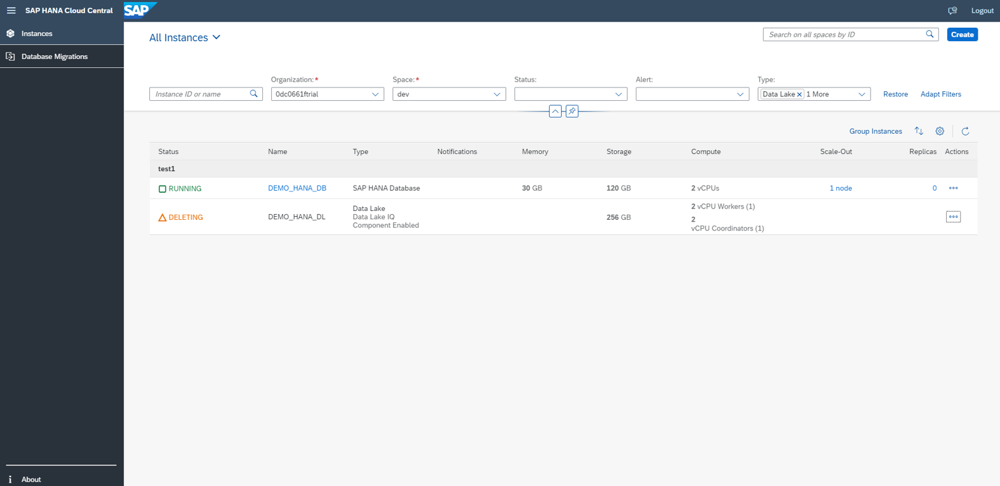
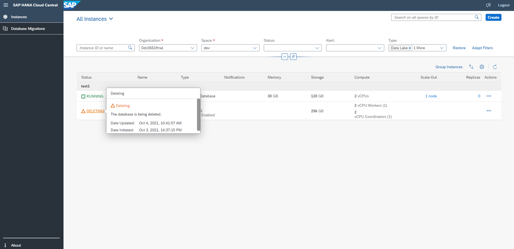

# Exercise 6 - Delete Instances

In this section, we will see how to delete an instance that we have created and worked on so far. The delete functionality is similar across all types of instances.  Here is a look at deleting an SAP HANA Cloud, data lake instance we created earlier.

1. Click on More(...) button under the Actions list.
    <kbd>
    
    </kbd>
    
2. Click on Delete. A Delete pop up comes up, asking to type ‘DELETE’.** Note: Please do not delete the instance now as it will be used in the subsequent exercises.**
    <kbd>
    
    </kbd>
    
3. On the overview page, we can see that the status is now 'Deleting' for the instance that we just initiated the delete process. Click on 'Deleting' hyperlink to have a look at details. The instance is permanently and irreversibly deleted.
    <kbd>
    
    </kbd>
    <kbd>
    
    </kbd>
    
Note: If you delete an SAP HANA Cloud database instance, then the corresponding SAP HANA Cloud, data lake instance is also deleted.

Continue to - [Exercise 7 - Giving Feedback ](../ex_7/README.md)
