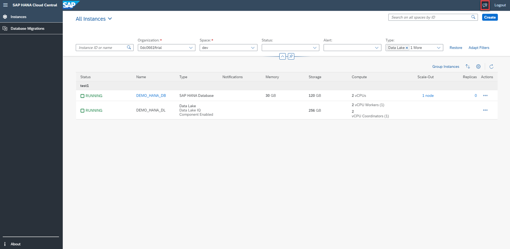
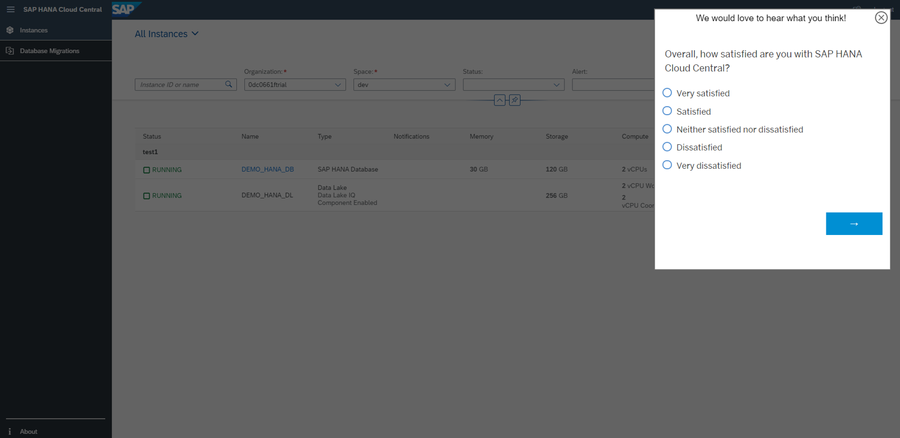
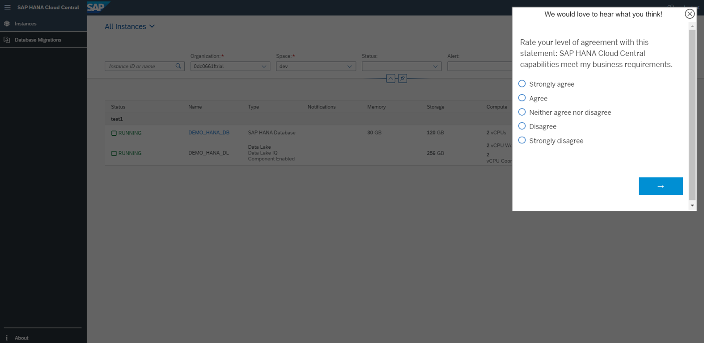
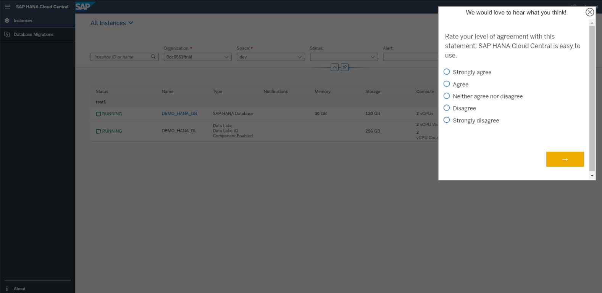
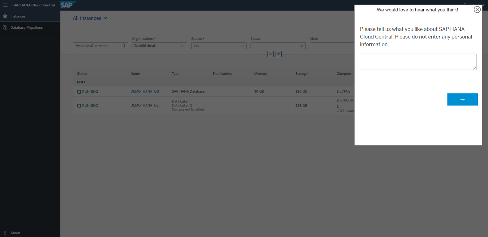
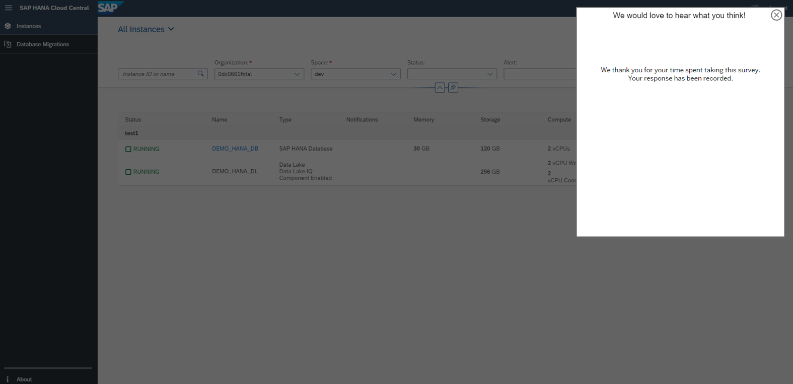

# Exercise 7 - Giving Feedback

In this section, we will discuss about giving feedback using SAP HANA Cloud Central.
 
To start with, we can see a button at the right top corner (next to the Logout button) of the SAP HANA Cloud Central page.

 

1. Click on the Give Feedback button. A pop over opens up. Express the level of satisfaction for using SAP HANA Cloud Central in the first question and click on the next arrow.

 

2. Answer the second question and click on next arrow.

 

3. Answer the third question and click on next arrow.

 

4. In the forth question, please tell us about what you like about SAP HANA Cloud Central. This completes the survey.

 

 

