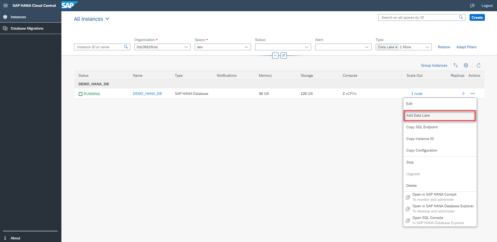
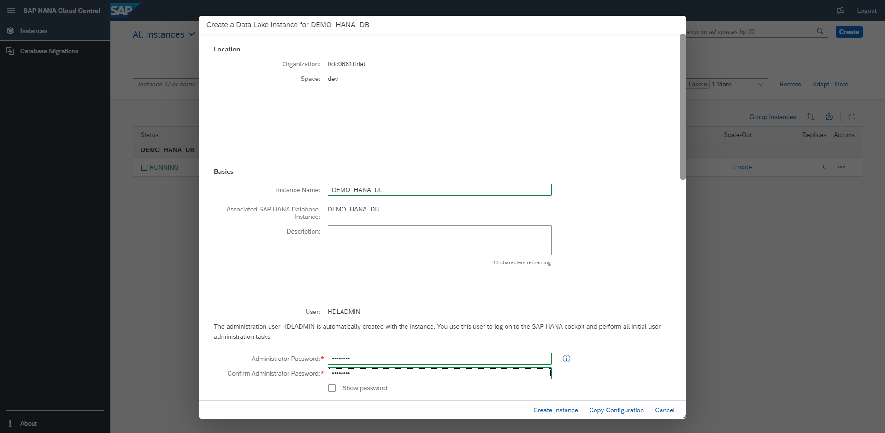
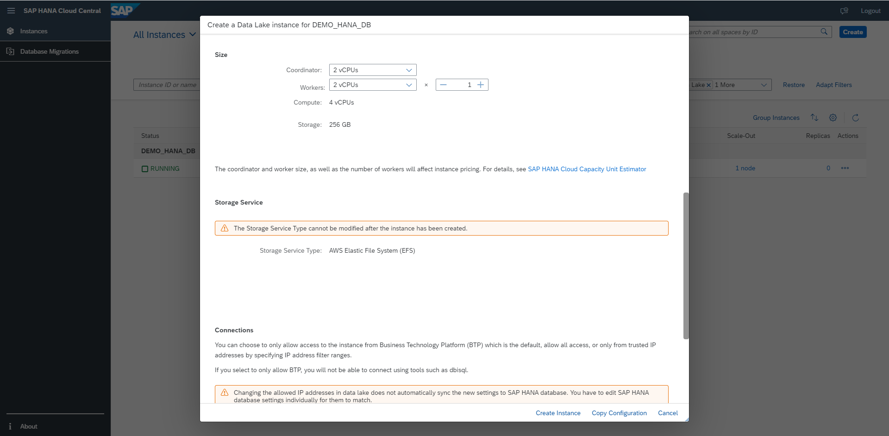
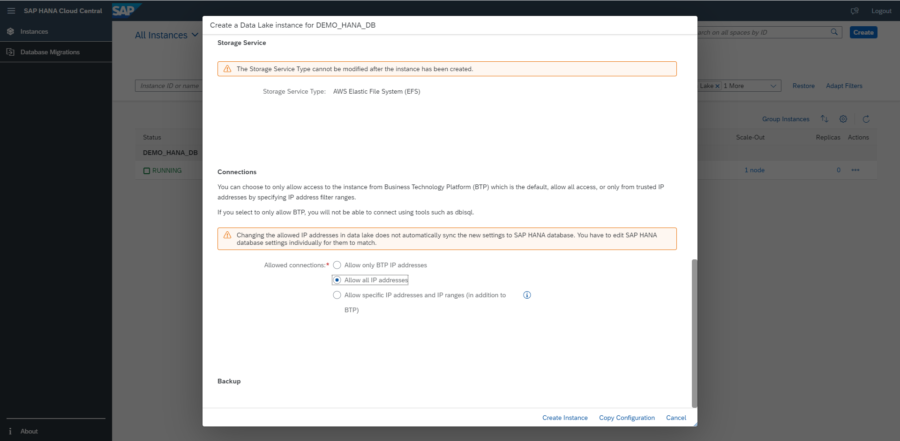
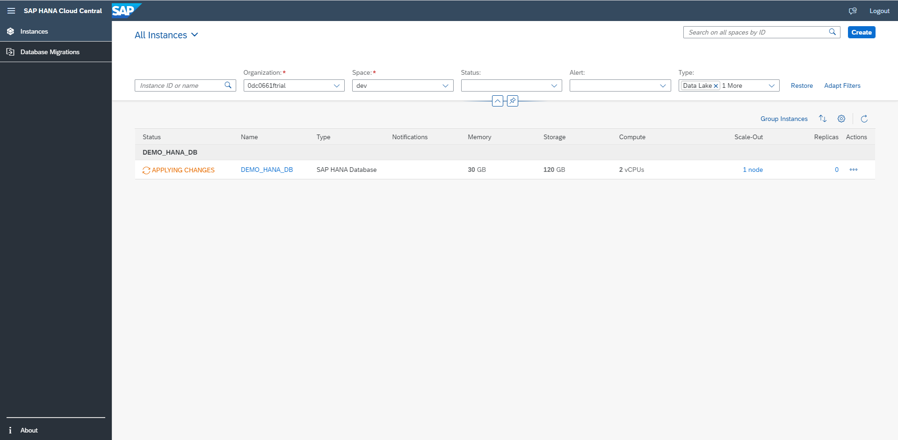

 # Exercise - Add a Data Lake to an Existing SAP HANA Database Instance
In this exercise, let's see how to add an SAP HANA Cloud, Data Lake instance to an SAP HANA Cloud, SAP HANA Database instance.

1. Click on '...' (More) button in the Actions column of your database instance "DEMO_HANA_DB".
    <kbd>
    
    </kbd>
    
2. From the Actions menu, choose Add Data Lake.
    <kbd>
    
    </kbd>
    
3. Specify the SAP HANA Cloud, Data Lake parameters. Enter the instance name as "DEMO_HANA_DL".
    <kbd>
    
    </kbd>
    <kbd>
    
    </kbd>
    <kbd>
    
    </kbd>
    
4. Select Create Instance to add a data lake with the above specifications to your existing SAP HANA instance.
    <kbd>
    
    </kbd>
    <kbd>
    
    </kbd>
    
Continue to - [Exercise 2 - Apply Filters](../ex1/README.md)

