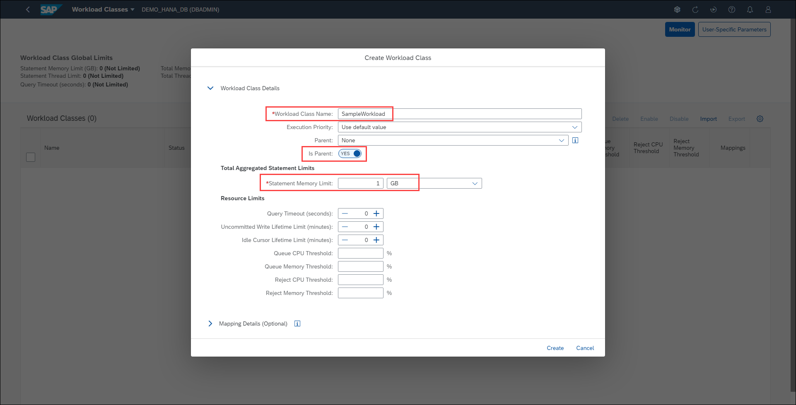

# Exercise 10: Managing Workload Classes

We manage workload in SAP HANA by creating workload classes and workload class mappings. Appropriate workload parameters are then dynamically applied to each client session. You can classify workloads based on user and application context information and apply configured resource limitations (for example, a statement memory limit). Workload classes allow SAP HANA to influence dynamic resource consumption on the session or statement level. In this exercise you will learn on how to create Workload classes and how to monitor them.

1. Locate the **Data Administration** card on the Database Overview page and click **Manage workload classes**.

    

2. The *Workload Classes* application displays the parameters for every workload class in the system and this is where can create a new workload class. Click the **Create** button.

    

3. You can create a workload class by entering a class name, execution priority, limit type, statement memory limit, and statement thread limit. You also have the option to map workload classes to user groups in the *Mapping Details* section of the dialog. Create a new workload class with the following details:

    - Workload Class Name: SampleWorkload
    - Is Parent: Yes
    - Statement Memory Limit: 1 GB

    We're defining a workload class named "SampleWorkload" as a parent workload, meaning that it can have child workloads that inherit its limits (i.e. SAP HANA supports hierarichal workload classes). The statement memory limit for this workload class is 1 GB. Click the **Create** button.

    

4. The newly created workload class appears in the table. Notice a notification appears under the *Mappings* columns, indicating that you need to assign a mapping. The assignment can be done when the workload class is created, or by clicking on the right arrow button at the end of the workload class row. Click on the **right arrow** to assign a mapping.

    

5. Click the **Create** button from the *Workload Classes* app and provide the following details for the mapping:

    - Mapping Name: SampleMapping
    - Database User Name: DBADMIN

    This mapping associates the database user *DBADMIN* to the workload we created earlier, limiting its statement limit to 1 GB. Click the **Create** button from the *Create Workload Mapping* dialog.

    

6. The newly created mapping appears in the table. Click the **Back** button to see the table of workload classes.

    

7. Other operations you can perform from this application include:

    - Enable/disable/delete an existing workload class
    - Import/export workload classes as compressed ZIP files
    - Define user-specific parameters (execution priority, statement limit and statement thread limit)
    - Monitor workload classes

8. On the drop-down menu from the cockpit's toolbar (top left), click on **Workload Classes** and select **Database Overview** from the menu to return to the Database Overview page.

Congratulations! You have completed the exercises for the SAP HANA cockpit and you are now able to monitor and manage individual SAP HANA databases.

Continue to [SAP HANA database explorer - Exercise 1](../../database_explrer/ex1)