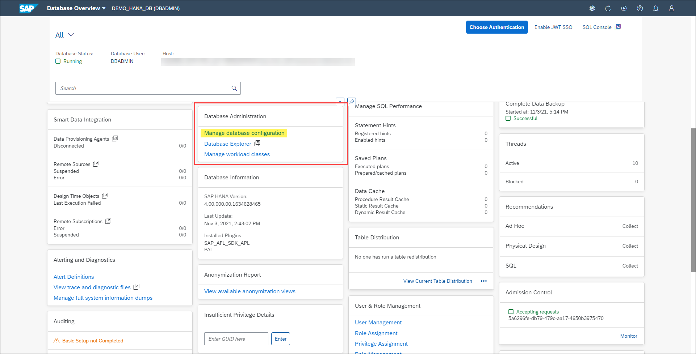

# Exercise 2: Configuring Database Properties

An SAP HANA database has several configuration (*.ini ) files that contain properties for configuring the database.

SAP HANA's configuration files contain parameters for global database configuration (global.ini), as well as the configuration of each service in the system (for example, indexserver.ini).
Properties can be configured at different layers, depending on the configuration file:

- DEFAULT: The default value for the property
- DATABASE: The database-specific value for the property

In this exercise, you will change a few properties using the "Database Configuration" application.

1. Locate the **Database Administration** card and click the link **Manage database configuration** (HINT: use the search bar to find it faster).

    

Continue to [Exercise 3: Managing Services](../ex_3/README.md)