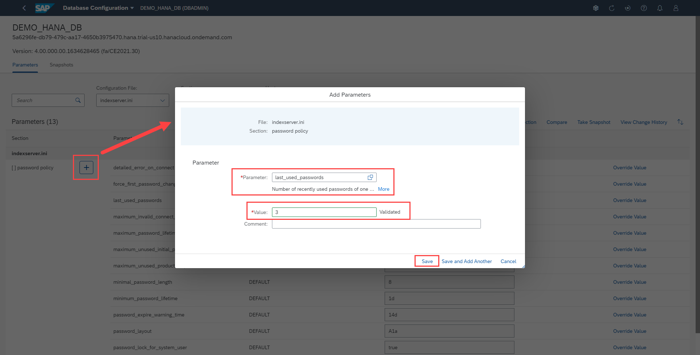
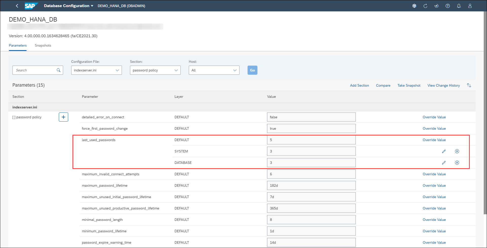

# Exercise 2: Configuring Database Properties

An SAP HANA database has several configuration (*.ini ) files that contain properties for configuring the database.

SAP HANA's configuration files contain parameters for global database configuration (global.ini), as well as the configuration of each service in the system (for example, indexserver.ini).
Properties can be configured at different layers, depending on the configuration file:

- DEFAULT: The default value for the property
- DATABASE: The database-specific value for the property

In this exercise, you will change a few properties using the "Database Configuration" application.

1. Locate the **Database Administration** card and click the link **Manage database configuration** (HINT: use the search bar to find it faster).

    

2. This application provides a visual way to edit properties by selecting a configuration file and its section.

    The Database Configuration page allows for the user to manage and edit many different properties of their system databases. Properties can also be changed at the HOST layer, if the SAP HANA system is configured as multi-host. In this app, you can perform the following operations:
    
    - Search globally for a configuration file, section, specific value or layer type
    - Add a section to a configuration file
    - Compare parameters
    - Take a parameter snapshot with optional notes
    - View your change history to keep track of your configuration edits
    - Add a parameter to a section

    

3. Let's change a parameter. Enter **indexserver.ini** in the *Configuration File* text field. You can use the drop-down list box to select the configuration file, or you can begin typing its name and the text box will auto-fill. Enter **password policy** in the *Section* text field. Click **Go**.

    

4. Click the **+** button to bring up the dialog to add a new parameter.

    Click on the **Search** button to bring up a pop up with all possible parameters that can be added for this section and select **last_used_passwords** from the list. Notice the description of the parameter appears beneath the text field.
    
    Enter **3** in the *Value* text field. Notice the value is automatically validated and an error message appears if the value is not valid (e.g. not an integer or a negative number).

    Click on **Save**. You may receive a message about overwriting an existing parameter, so simply proceed by clicking on **OK**.

    

5. We've edited this password policy parameter so that the user cannot change their password to be one of the last 3 passwords used (instead of the default last 5 passwords used).

    

6. Click the **Back** button at the top left to return to the Database Overview page.

Continue to [Exercise 3: Managing Services](../ex_3)