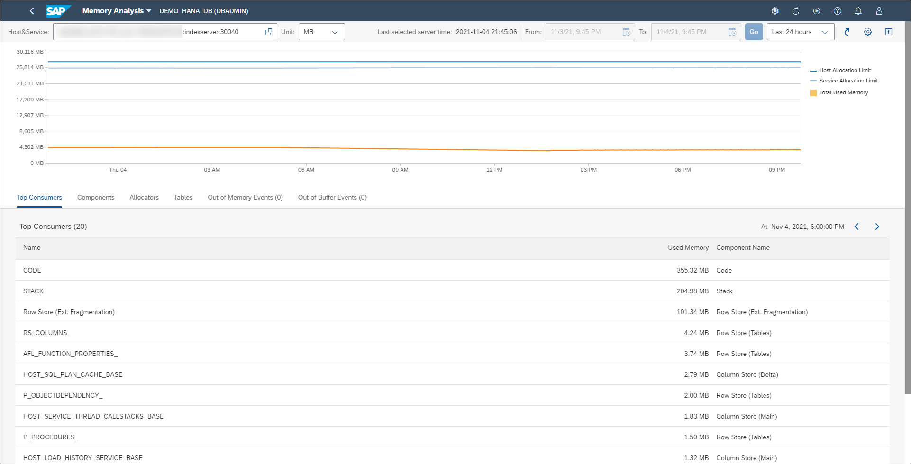
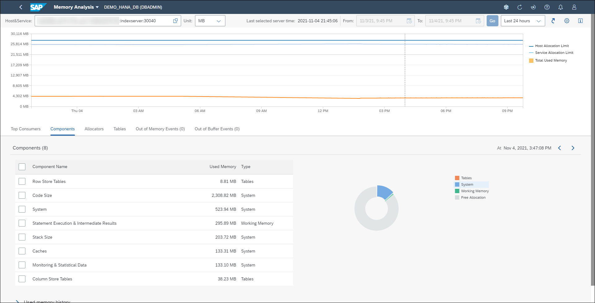

# Exercise 3: Managing Services

To monitor the health of your SAP HANA database in more detail, for example to troubleshoot performance bottlenecks, you can analyze the status and memory usage of individual database services. The Memory Analysis application is helpful here as it provides a more detailed breakdown of memory usage. It enables you to visualize and explore the memory allocation of every service of a selected host during a specified time range. If you notice an increase in overall memory usage, you can investigate whether it's due to a particular component, subcomponent, or table.

In this exercise, you review the information displayed in the Services card, examine the different database service management operations you have access to, and perform a basic analysis of memory usage.

1. Locate the *Services* card.  It displays metrics regarding the operational status of the SAP HANA database. Here you see the status of the database, "Running" in this case. Other possible values include "Running with issues", "Stopped", "Error" or "No SQL Access". Click the button **Manage Services**.

    

2. The Manage Services app enables you to monitor the health of your SAP HANA database in more detail, for example, to troubleshoot performance bottlenecks, you can analyze the status and resource usage of individual database services. If necessary, you can perform follow-up operations, such as stopping a service, or killing a service. You can also reset memory statistics and navigate to Alerts application. Other operations available here include:

    - View detailed service information
    - View CPU usage of the service. Clicking on the mini bar chart redirects you to the Performance Monitor to see more details
    - View memory usage of the service, showing used memory (dark green), peak memory (light green), effective allocation limit (grey bar) and physical memory (light grey background)
    - Sort the table and add/remove other metrics (e.g. used memory, CPU process %, etc.) and search for specific services

    

3. Let's personaliza the table a little by adding a column. Click the **Settings** button (gear icon above the table on the right).

4. Enter *used memory* in the search bar. Select **Used Memory (MB)** and click on **OK**.

    

5. The column "Used Memory (MB)" is added to the table. As you can see, the indexserver service consumes the most memory.

6. Let's examine the memory usage for the indexserver service. Locate it and click on the *horizontal memory mini bar chart* to launch the Memory Analysis tool. You can also launch the same tool by clicking on the used memory value for the indexserver service.

    

7. The Memory Analysis app enables you to visualize and explore the memory allocation of every service of a selected host during a specified time range. If you notice an increase in overall memory usage, you can investigate whether it's due to a particular component, subcomponent, or table. You can perform the following operations:

    - Choose which host and service to examine
    - Change the units for the displayed values (MB, GB, or TB)
    - Select a time range to investigate, from the last 24 days to the last 6 weeks, or a custom range
    - Examine the used memory by the top consumers, components, allocators and tbales
    - Examine out of memory events
    - Examine our of buffer events (when using SAP HANA native storage extensions)
    - The upper time chart visualizes the memory statistics. In addition to the total used memory by SAP HANA, you also see the allocation limits for the service and the host

    

8. When analyzing memory, you typically select the appropriate time range to examine, then click on a specific time in the upper chart. The lower chart is then automatically populated based on that time, allowing you to deepen your analysis. Click the upper chart on an area where the used memory is more than 0 MB (look for an orange colored section) and then click on the **Components** tab. The donut chart displays the memory details at that specific point in time.

    

9. Let's investigate a couple of components in more detail. Check the components **System** and **Statement Execution & Intermediate Results**.  Scroll to the bottom of the page and click the arrow to expand the **used memory history** chart. The history chart shows the memory usage over time for the components you selected.

    

10. You can deepen your analysis by looking at the statistics about the memory used by data tables. Click the **Tables** tab. The top chart shows the breakdown of memory usage of the top 10 highest consuming tables for the specific time you're investigating. The bottom chart shows the memory usage of the top 10 tables with the largest change in consumption for the selected time period.

    

11. On the drop-down menu from the cockpit's toolbar (top right), click on **Memory Analysis** and select **Database Overview** from the menu to return to the Database Overview page.

    

Continue to [Exercise 4: ](../ex_4)