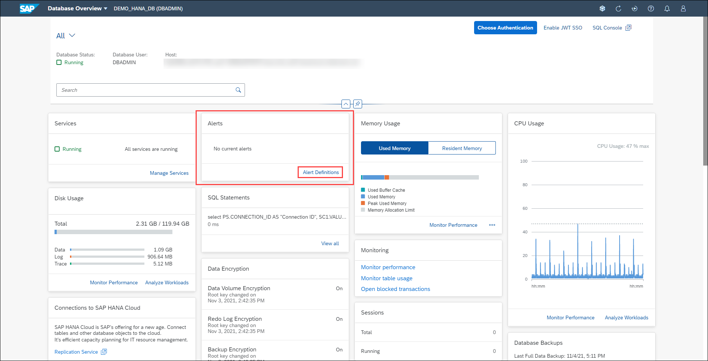
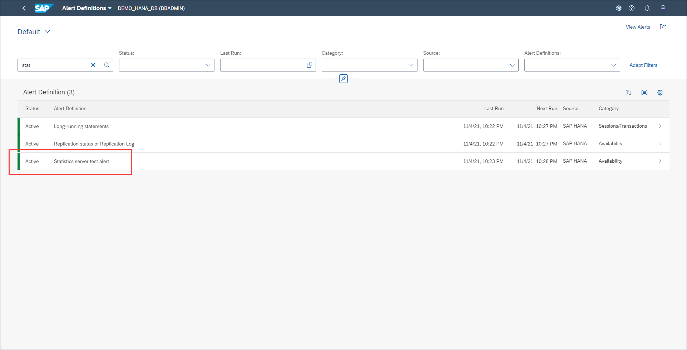
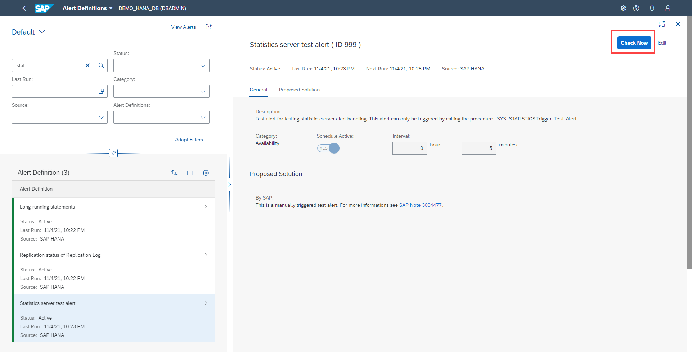
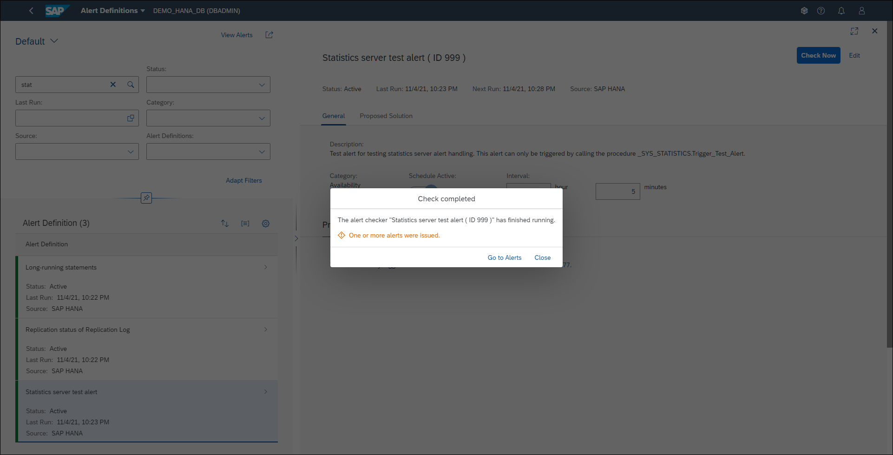
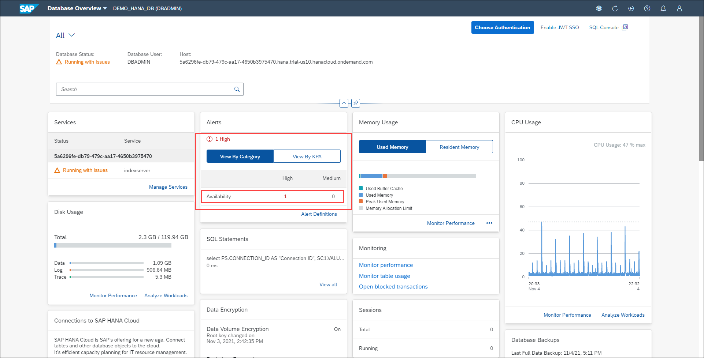
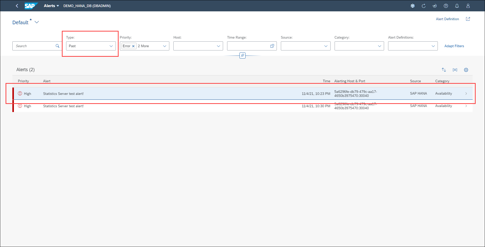
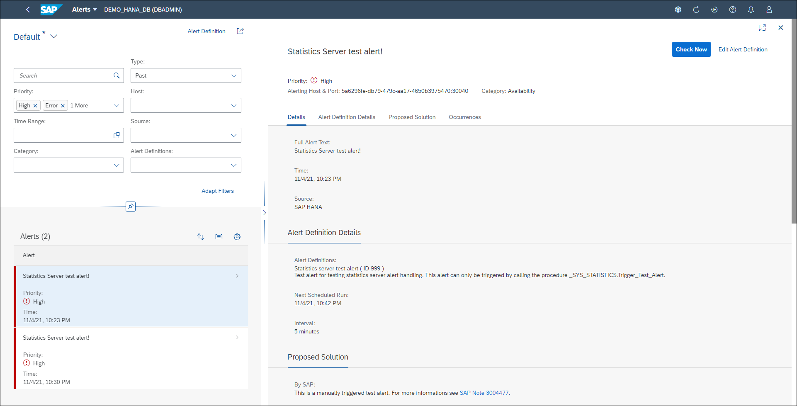

# Exercise 4: Managing Alerts

As an administrator, you actively monitor the status of the system, its services, and the consumption of system resources. However, you are also alerted of critical situations, for example: memory utilization is reaching a critical level, or a server has stopped.

The internal monitoring infrastructure of the SAP HANA database is continuously collecting and evaluating information about status, performance, and resource usage from all components of the SAP HANA database. In addition, it performs regular checks on the data in system tables and views and when configurable threshold values are exceeded, issues alerts. In this way, you are warned of potential problems. The priority of the alert indicates the severity of the problem and depends on the nature of the check and configured threshold values.

In this exercise, you'll examine the Alerts card, drill-down to obtain more information about raised alerts and configure alert thresholds.

1. Locate the *Alerts* card. This card displays the number of high (in red colored font) and medium (in orange colored font) priority alerts in the database, classified into one of the 10 alert categories in SAP HANA. It allows you to quickly identify issues in the database and drill-down to the Alert Details app to analyze the situation. You can also choose to view alerts by the key performance areas of available, performance and capacity. Click on **Alert Definitions** in the Alerts card.

    

2. The Alert Definition screen allows you to choose from many existing alerts, search for them and manage how the different SAP HANA alerts are triggered. On clicking on a particular alert, it displays information about the alert, including its description, category, schedule, threshold values, proposed solution and notifications. Locate (or search)  **Statistics server test alert** and click on that row.

    

3. In this screen, you can change the thresholds that trigger the alert. Since we are dealing with a test alert, there are no thresholds to configure. Instead, we can simply trigger the alert - click the **Check Now** button in the top right corner.

    

4. When the alert checker finishes running, you get a message with the result. In this case, one alert was issued. Click the **Close** button.

    

5. Click the **Back** button twice from the cockpit's toolbar to return to the Database Overview page.

6. Locate the *Alerts* card and notice the alert count for Availability increased. The number of alerts depends on the database, but you’ll see at least one high and/or medium priority alert. Click on **Availability** to open the *Alerts* application.

    

7. To see the test alert that was just triggered, on the header select the *Type* of alert to be **Past**.

    

8. Click on the alert to navigate to the **Alert Details** screen to see detailed information about the alert, along with a proposed solution.

    

9. Click the **Back** button at the top left to return to the Database Overview page.

Continue to [Exercise 5: Monitoring Memory Usage](../ex_5)