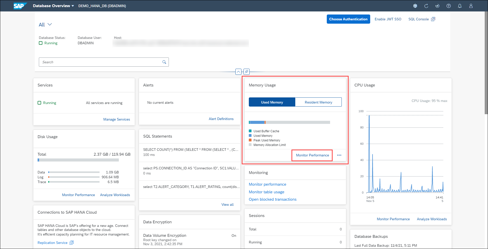
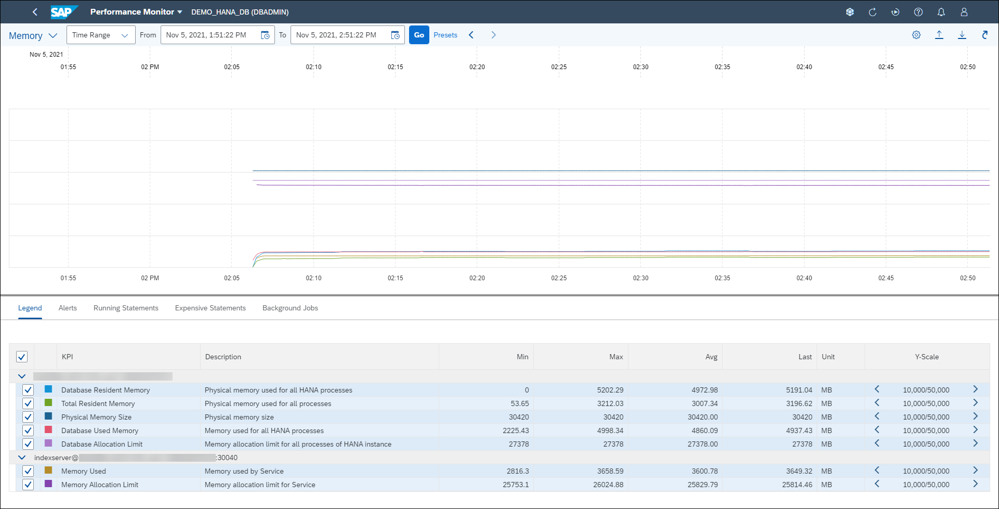

# Exercise 5: Managing Alerts

SAP HANA administrators must carefully monitor system computing resources to ensure optimal operation of the database. There are many metrics available to monitor in the SAP HANA cockpit, including memory, CPU and disk usage. You can view precise consumption details for those resources, as well as historical utilization information.

In this exercise, you'll examine the memory utilization of an SAP HANA database and observe the behavior of a few KPIs. You'll also learn to customize the utilization charts to display the information most relevant to your situation.

1. Locate the *Memory Usage* card. It displays how much memory the host has consumed for the past 2 hours. There are also CPU Usage and Disk Usage cards, showing those metrics for the same time period. Let's investigate the memory utilization for this database. Click **Monitor Performance**.

    

2. The Performance Monitor appears, allowing you to see KPIs for memory usage. You can change the time range to display. You can export a complete snapshot of the performance monitor data into a ZIP file that you can download and send to SAP Support to analyze and diagnose problems with the SAP HANA database. Similarly, you can import performance monitor data from a ZIP file into the SAP HANA cockpit.

    

Continue to [Exercise 6: ](../ex_6)