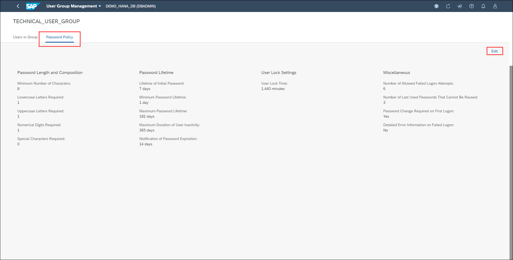
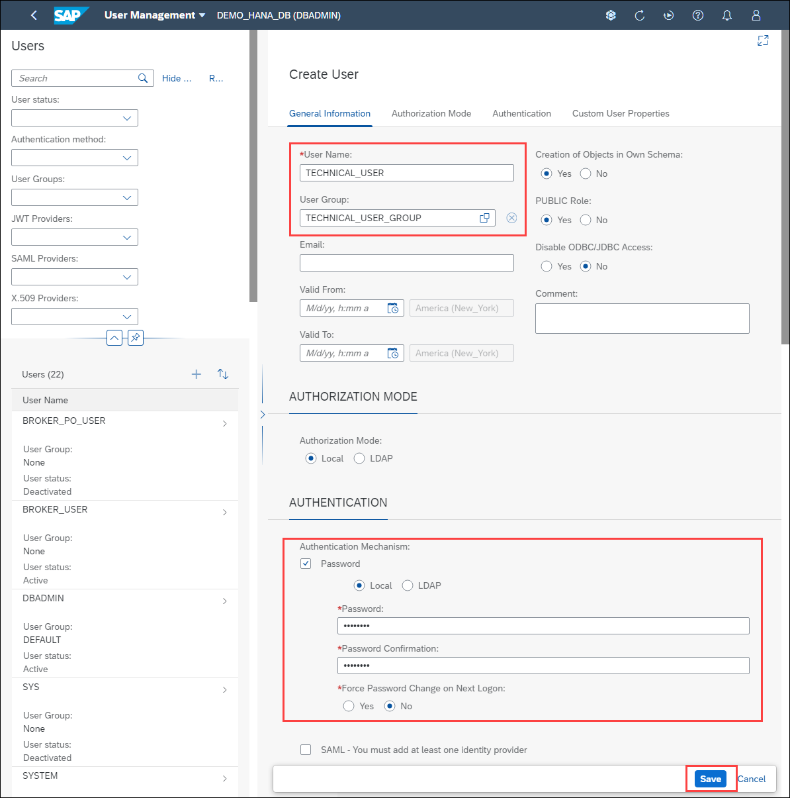
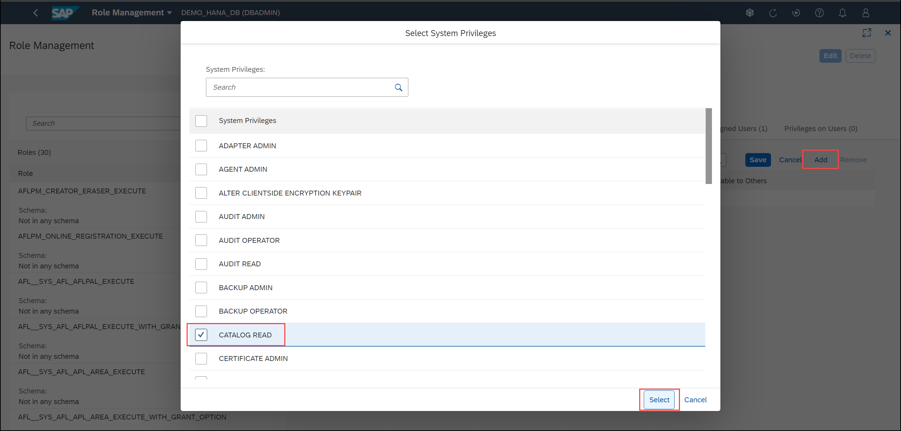

# Exercise 6: Security Basics

Security administration encompasses a wide range of topics, from monitoring critical security settings, to auditing activity in the SAP HANA database, to managing SAP HANA users and roles.
This exercise concentrates on user, role and user group management to provide you with a basic understanding of this important task of database administration.

Every user who wants to work with the SAP HANA database must have a database user. As the database administrator, you create and provision the required users, as well as perform other tasks related to user administration. Roles are the standard mechanism of granting privileges to SAP HANA database users. It is recommended that you assign roles to users instead of granting privileges individually. User groups are a mechanism to organize users with similar roles or purposes.

In this exercise, you'll create a new user, a new role and a new user group.

1. Locate the *User & Role Management* card. Let's first create a new user group. Click the **User Group Management** hyperlink.

    

2. You can use user groups to group together users with similar roles and to enforce a specific password policy on the group. Click the **New User Group** button.

    

3. Enter *TECHNICAL_USER_GROUP* in the Name text field. Leave the rest of the options in their default settings. Click **Add**.

    

4. Let's explore what we can do with our newly created user group. Click the *TECHNICAL_USER_GROUP* row

    

5. From here you can move existing users to this user group. We haven't created our technical user yet so we won't do this from this page. We can also create a new user to assign to this user group.

    

6. We'll change this user groups' password policy. Click the **Password Policy** tab and click on **Edit**.

    

7. The password policy can be configured to be different from the database's password policy and will be applied to any users belonging to this user group. From here you can change password policies, such as length requirements, character requirements, password lifetime, user Lock Settings and expiry, etc. Make the following changes:

    - Lifetime of initial password: 14 days
    - Password change required on first logon: No
    - Notification of password expiration: 30 days

    Click the **Save** button.

    

8. Let's now create a new user. Click the **Create User** button.

    

9. You are now in the  **User Management** app and can provide the details for the new user. Notice the *user group* field is pre-populated and that's because we navigated here from the *User Group Management* app. Create a new user with the following attributes:

    - User name: TECHNICAL_USER
    - User group: TECHNICAL_USER_GROUP
    - Select the password authentication mechanism check box
    - Password: Abcd1234
    - Password confirmation: Abcd1234
    - Force password change on next logon: No

    Click **Save** in the bottom right corner.

    

10. On the drop-down menu from the cockpit's toolbar (top left), click on **User Management** and select **Role Management** from the menu to navigate to that app.

    

11. You are now in the **Role Management** app. Click the **plus sign (+)** and create a new role with the following attributes:

    - Role: TECHNICAL_USER_ROLE

    

12. You can now add privileges to this user role. Click the **System Privileges** tab and click the **Edit** button.

    

13. Click the **Add** button and select the **CATALOG_READ** system privilege. Click the **SELECT** button to dismiss the dialog.

    

14. Click the **Save** button. Notice the number in the parentheses besides "System Privileges" is now one. The parentheses beside the privilege type shows the number privileges granted to this role.

    

15. Click the **Object Privileges** tab and click the **Edit** button.

    

16. Click the **Add Object** button and search for the **_SYS_STATISTICS** object. Notice you can also filter by object type and schema. Select the object **_SYS_STATISTICS** and Click the **SELECT** button to dismiss the dialog.

    

17. Now from the Add *Objects with Privileges* dialog, scroll down until you see **SELECT** and check it. Click **OK** to return to the *Role Management* app.

    

18. Click the **Save** button to complete the operation of adding the object privilege.

    

19. Let's now assign the newly created *TECHNICAL_USER_ROLE* to our user *TECHNICAL_USER*. On the drop-down menu from the cockpit's toolbar (top left), click on **Role Management** and select **Assign Roles** from the menu to navigate to that app.

    

20. You are now in the **Role Assignment** app, where you can search based on either users or roles. Search for and select the user *TECHNICAL_USER* and click the **Edit** button.

    

21. Click the **Add** button and search for the role **TECHNICAL_USER_ROLE** that we created earlier. Select that role and click the **Select** button.

    

22. Click the **Save** button to complete the operation of assigning the role to the user.

    

23. On the drop-down menu from the cockpit's toolbar (top left), click on **Role Assignment** and select **Database Overview** from the menu to return to the Database Overview page.

24. There is one more link in the *User & Role Management* card and that is *Privilege Assignment*. This application allows you to assign the same privileges that you saw in the Role Assignment application, but this time without having to create a role for the user. This is useful for unique users that require a different combination of privileges than the main reusable roles.

Continue to [Exercise 7: Performance Management](../ex_7)