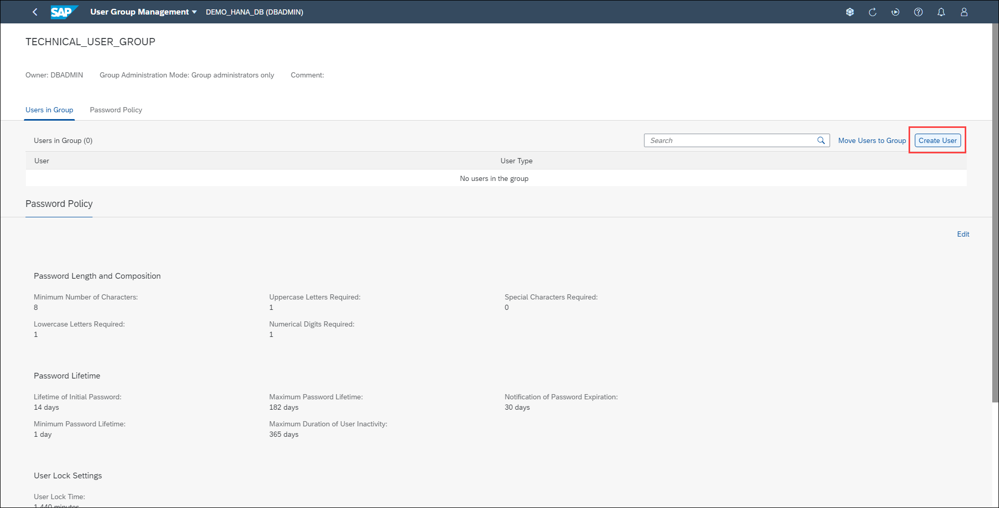

# Exercise 5: Security Basics

Security administration encompasses a wide range of topics, from monitoring critical security settings, to auditing activity in the SAP HANA database, to managing SAP HANA users and roles.
This exercise concentrates on user, role and user group management to provide you with a basic understanding of this important task of database administration.

Every user who wants to work with the SAP HANA database must have a database user. As the database administrator, you create and provision the required users, as well as perform other tasks related to user administration. Roles are the standard mechanism of granting privileges to SAP HANA database users. It is recommended that you assign roles to users instead of granting privileges individually. User groups are a mechanism to organize users with similar roles or purposes.

In this exercise, you'll create a new user, a new role and a new user group.

1. Locate the *User & Role Management* card. Let's first create a new user group. Click the **User Group Management** hyperlink.

    

2. You can use user groups to group together users with similar roles and to enforce a specific password policy on the group. Click the **New User Group** button.

    

3. Enter *TECHNICAL_USER_GROUP* in the Name text field. Leave the rest of the options in their default settings. Click **Add**.

    

4. Let's explore what we can do with our newly created user group. Click the *TECHNICAL_USER_GROUP* row

    

5. From here you can move existing users to this user group. We haven't created our technical user yet so we won't do this from this page. We can also create a new user to assign to this user group.

    

6. We'll change this user groups' password policy. Click the **Password Policy** tab and click on **Edit**.

    

7. The password policy can be configured to be different from the database's password policy and will be applied to any users belonging to this user group. From here you can change password policies, such as length requirements, character requirements, password lifetime, user Lock Settings and expiry, etc. Make the following changes:

    - Lifetime of initial password: 14 days
    - Password change required on first logon: No
    - Notification of password expiration: 30 days

    Click the **Save** button.

    

8. Let's now create a new user. Click the **Create User** button.

    

Continue to [Exercise 7: ](../ex_7)