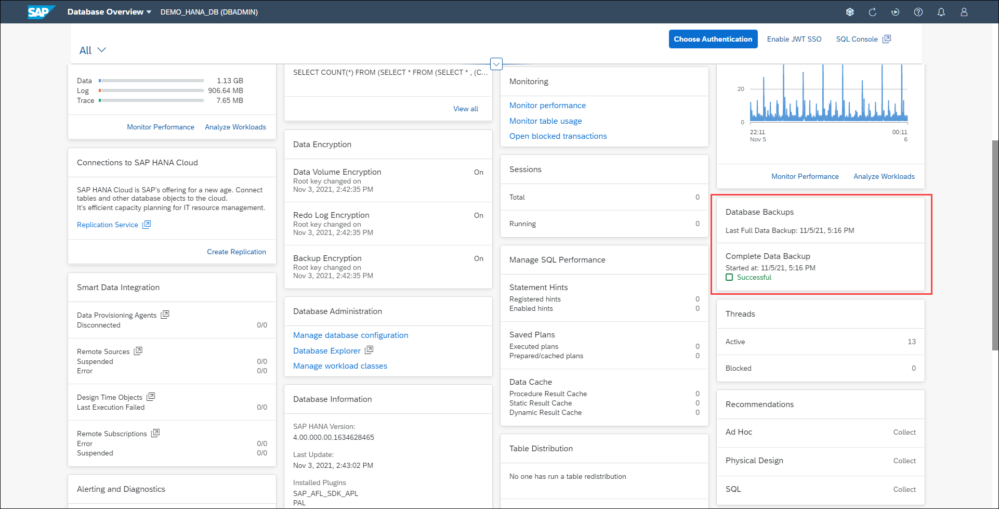

# Exercise 8: Database Backup

Database backups are crucial to ensuring data stays safe. In the SAP HANA Cloud service, all backups are created for you, but you can view the backup catalog in the SAP HANA cockpit.

1. Let's now look into the backup of our database. Locate the **Database Backups** card and click on it.

    

2. The backup catalog is presented. Switch the view from table to a horizontal stacked chart by clicking on the button **horizontal-stacked-chart** above the table and to the right. This chart displays all the backups stored in a statistical or pictorial format i.e. in form of graphical representation that is easy to interpret.

    

3. Click on the **horizontal bar for one of the backups** to get details on memory consumed by complete data backup and other backup types. Notice the amount of memory occupied by Log and Catalog Backups. Click **Close** button to close the pop up.

    

4. Click the **top most horizontal bar** to see the space used for each backup type, offering you a complete picture of how much space is consumed by all the backup files.

    

5. Use the filter button to see the backups generated on a specific time frame. Let's do that: click on the **Filter** button, then the **Generation Start Time** option.

    

6. Select **Last 24 Hours** and click on **OK** to apply the chosen time frame. Notice you can also select a custom time frame.

    

7. Switch the view from horizontal stacked chart to a table view by clicking the **table-view** button above the table and to the right.

    

8. Click on **any of the backup records** to display the Backup details page, where you can see more information about the backup.

    

9. On the drop-down menu from the cockpit's toolbar (top left), click on **Backup Catalog** and select **Database Overview** from the menu to return to the Database Overview page.

Continue to [Exercise 9: Recent Activities and Frequently Used Apps](../ex_9)