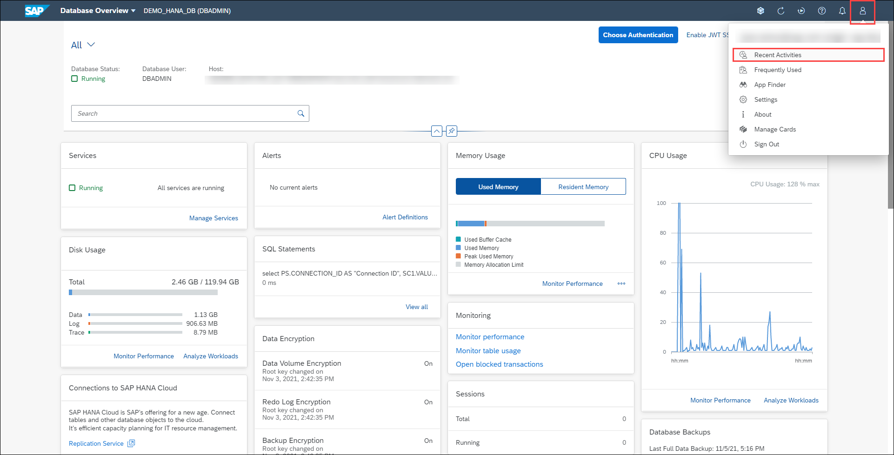

# Exercise 9: Recent Activities and Frequently Used Apps

As the database administrator, you have the option to view your recent activities and most frequently used applications in the Database Overview page of your selected database in order to trace back your activities or access your favorite applications faster.

1. Click the **User** button at the top right of the Database Overview page and click on **Recent Activities**.

    

2. Under the *Recent Activity* you see a list of the applications the cockpit user launched. The history can stretch back to several days. Notice there's also a *Frequently Used* tab, where you find the list of frequently used applications with the most used application at the top and least used application near the bottom. Click the **Close** button to dismiss the dialog go back to the Database Overview page.

    

Continue to [Exercise 10: Managing Workload Classes](../ex_10)